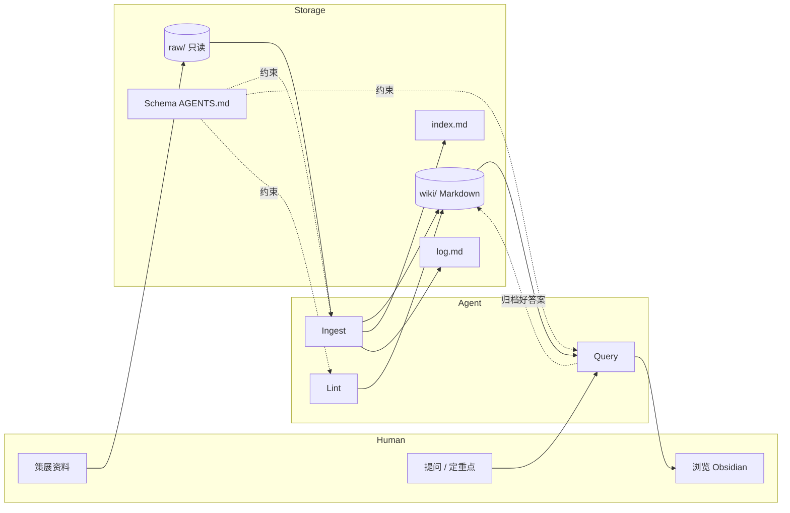

# Karpathy LLM Wiki 原理解读

> 基于 [Andrej Karpathy 的 Gist：llm-wiki.md](https://gist.github.com/karpathy/442a6bf555914893e9891c11519de94f)（2026-04-04 发布，社区 Star 5000+）  
> 文档生成日期：2026-05-20  
> 说明：原文是**模式说明（pattern）**，不是可运行的产品代码；Karpathy 本人也明确写道「intentionally abstract」。

---

## 1. 这是什么？

**LLM Wiki** 是一套用 LLM 构建**个人/团队持久化知识库**的设计模式，常被当作 **Agent 记忆系统** 的一种轻量、可审计的实现思路。

与传统 RAG（检索增强生成）不同，它强调：

| 维度 | 传统 RAG | LLM Wiki |
|------|----------|----------|
| 知识形态 | 原始文档分块 + 向量索引 | **已编译、已交叉引用** 的 Markdown Wiki |
| 每次问答 | 从原始片段重新拼装理解 | 直接读 Wiki 中已沉淀的实体页、主题综述 |
| 知识是否累积 | 弱（对话结束即散） | **强**（每 ingest 一次，Wiki 变厚一层） |
| 维护者 | 人 + 偶尔手工整理 | **LLM 负责维护**，人负责策展与提问 |

一句话：**不是「每次问的时候再去翻书」，而是「让 LLM 持续写一本会自己更新的维基」。**

Karpathy 的工作流比喻：

- **Obsidian** = IDE（人浏览、看图谱、读链接）
- **LLM Agent** = 程序员（写文件、改交叉引用、做 bookkeeping）
- **Wiki 目录** = 代码库（可 git 版本化的 Markdown 仓库）

---

## 2. 要解决的核心问题

### 2.1 RAG 的局限

典型 RAG 流程：上传文档 → 切块 → 查询时检索相关 chunk → 生成答案。

问题在于：

1. **没有累积**：复杂问题需要综合 5 篇资料时，每次都要重新检索、重新拼接。
2. **交叉引用缺失**：chunk 之间的人物、概念、矛盾关系不会持久保存。
3. **合成成本高**： subtle 问题每次都在「从零发现知识」，而不是读「已经写好的综述」。

NotebookLM、ChatGPT 文件上传、多数企业 RAG 都偏这一路径。

### 2.2 LLM Wiki 的转向

当新资料进入时，LLM **不只索引**，而是：

1. 阅读原始资料；
2. 提取关键信息；
3. **写入/更新** Wiki 中的实体页、概念页、主题摘要；
4. 标注新旧矛盾、强化或修正既有综合结论。

知识 **编译一次、持续保鲜（kept current）**，查询时读的是「成品」，不是「原料碎片」。

> **Wiki 是持久、复利型产物（persistent, compounding artifact）**：链接已建好、矛盾已标记、综合结论已反映你读过的全部材料。

---

## 3. 三层架构

```
┌─────────────────────────────────────────────────────────┐
│  Schema（AGENTS.md / CLAUDE.md 等）                      │
│  约定目录结构、页面类型、ingest/query/lint 工作流          │
└─────────────────────────────────────────────────────────┘
                            ↓ 约束 Agent 行为
┌──────────────────────┐    ┌──────────────────────────────┐
│  Raw Sources（只读）   │ →  │  Wiki（LLM 全权维护）         │
│  论文/文章/图片/数据   │    │  实体页、概念页、对比、综合    │
│  不可变，真相来源      │    │  index.md + log.md + 交叉链接 │
└──────────────────────┘    └──────────────────────────────┘
         人策展                         人阅读、LLM 写入
```

### 3.1 Raw Sources（原始层）

- 你策展的资料集合：文章、论文、图片、数据文件等。
- **只读**：LLM 可读，但不应修改；这是 source of truth。
- 典型目录：`raw/`、`sources/` 等（具体由你与 Agent 在 Schema 中约定）。

### 3.2 Wiki（编译层）

- 一组 **LLM 生成的 Markdown 文件**。
- 页面类型示例：摘要页、实体页（人物/公司/概念）、主题综述、对比表、总览 synthesis。
- LLM 负责：新建页、更新页、维护 `[[wikilink]]`、处理矛盾、保持一致性。
- **人几乎不写 Wiki**，人负责：找资料、定方向、提好问题。

### 3.3 Schema（规则层）

- 例如 `AGENTS.md`（Codex）、`CLAUDE.md`（Claude Code）。
- 定义：目录结构、命名规范、ingest/query/lint 步骤、页面模板。
- 这是把「通用聊天机器人」变成「有纪律的 Wiki 维护者」的关键配置。
- 会随使用 **与人共同演化**（co-evolve）。

---

## 4. 三大操作（Operations）

### 4.1 Ingest（摄入）

流程示例：

1. 将新资料放入 `raw/`；
2. 指示 LLM 处理该资料；
3. LLM 阅读 → 与你讨论要点 → 写摘要页 → 更新 `index.md` → 批量更新相关实体/概念页（单次常触及 **10–15 页**）→ 在 `log.md` 追加记录。

工作方式可 **逐条人工参与**（Karpathy 偏好），也可批量低监督 ingest；应写入 Schema 供后续会话复用。

### 4.2 Query（查询）

1. 针对 Wiki 提问；
2. LLM 先查 `index.md` 定位相关页，再深入阅读；
3. 合成带引用的答案；输出可以是 Markdown、对比表、Marp 幻灯片、图表等。

**关键复利机制**：**高质量问答结果应归档为新 Wiki 页**，而不是留在聊天历史里消失。探索与 ingest 一样，都会让知识库变厚。

### 4.3 Lint（健康检查）

定期让 LLM 巡检 Wiki，例如：

- 页面间矛盾；
- 已被新资料取代的陈旧论断；
- 无入链的孤儿页；
- 被提及但未建页的重要概念；
- 缺失交叉引用；
- 可用网页搜索填补的数据缺口。

Lint 还能 **提议新问题、新资料方向**，维持 Wiki 长期健康。

---

## 5. 导航与日志：index.md 与 log.md

| 文件 | 取向 | 作用 |
|------|------|------|
| **index.md** | 按内容分类 | 全 Wiki 目录：链接 + 一行摘要 + 可选元数据（日期、来源数）；ingest 时更新；query 时 **先读 index 再下钻** |
| **log.md** | 按时间追加 | 只追加：ingest / query / lint 记录；建议统一前缀如 `## [2026-04-02] ingest \| Title`，便于 `grep` |

在中等规模（约 100 份来源、数百页）下，**仅靠 index 往往够用**，可暂不引入向量 RAG。规模变大后可加本地搜索（原文推荐 [qmd](https://github.com/tobi/qmd)：BM25 + 向量 + 重排，支持 CLI/MCP）。

---

## 6. 与「Agent 记忆系统」的对应关系

LLM Wiki 不是 MemGPT / Zep 那种带 API 的**记忆运行时**，而是一套 **文件系统 + Agent 工作流** 的记忆范式。可与分层记忆理论对照：

| 记忆类型（常见框架） | LLM Wiki 中的对应 |
|---------------------|-------------------|
| 原始经历 / 证据 | Raw Sources（不可变） |
| 工作记忆 / 当前任务 | 对话上下文 + 可选 `working/` 页 |
| 语义记忆 / 稳定事实 | Wiki 实体页、概念页、偏好页 |
| 程序/能力记忆 | Schema 中的工作流 + 反复验证的「做法」页 |
| 综合/计划 | synthesis 页、对比页、归档的 query 结果 |

与 [membrane RFC](research_repos/membrane/rfc.md) 等「类型化、可修订、带衰减」的记忆基底相比，LLM Wiki **更轻、更人类可读**，但 **类型与生命周期规则需靠 Schema 和 Lint 自觉维护**，没有数据库级强制。

精神渊源：Vannevar Bush 1945 年的 **Memex**——个人策展、文档间联想路径与文档本身同等重要；Bush 未解决的是「谁来做维护」，LLM Wiki 把维护成本压到接近零。

---

## 7. 推荐工具链（均可选）

| 工具 | 用途 |
|------|------|
| [Obsidian](https://obsidian.md/) | 浏览 Wiki、图谱视图、wikilink |
| Obsidian Web Clipper | 网页转 Markdown 进 raw |
| [qmd](https://github.com/tobi/qmd) | Wiki 本地混合检索 |
| Marp | 从 Wiki 生成幻灯片 |
| Dataview | 基于 YAML frontmatter 的动态列表 |
| Git | Wiki 即 Markdown 仓库，天然版本史 |

---

## 8. Karpathy 官方仓库检索结论

已对 [karpathy 的 63 个公开仓库](https://github.com/karpathy?tab=repositories)（GitHub API，按更新时间排序）做关键词与语义比对：**不存在名为 `llm-wiki` 的仓库，也没有任何仓库在代码或 README 中实现该 Gist 的完整三层架构。**

Gist 原文 **Note** 节写明：

> *This document is intentionally abstract. It describes the idea, not a specific implementation.*

因此：**LLM Wiki 目前仅发布为 Gist 思想文档**，实现需自行或与 Agent 协作搭建。

### 8.1 概念相关、但并非 LLM Wiki 实现的仓库

| 仓库 | Stars（约） | 与 LLM Wiki 的关系 |
|------|------------|-------------------|
| [reader3](https://github.com/karpathy/reader3) | ~3.6k | **读书记忆伴侣**：自托管 EPUB 按章阅读，便于把章节复制给 LLM「一起读」；**不维护**交叉链接 Wiki，属灵感/demo |
| [rendergit](https://github.com/karpathy/rendergit) | ~2.3k | 将任意 Git 仓库压成单页 HTML，供人或 LLM 一次性阅读；**一次性上下文**，非累积 Wiki |
| [researchpooler](https://github.com/karpathy/researchpooler) | ~435 | 论文发现与分析自动化；偏检索，非 Markdown Wiki 维护 |
| [arxiv-sanity-lite](https://github.com/karpathy/arxiv-sanity-lite) | ~1.6k | arXiv 论文推荐 UI；**论文管理**，非 Agent 记忆 Wiki |
| [hn-time-capsule](https://github.com/karpathy/hn-time-capsule) | ~631 | 用 LLM 回顾十年前 HN 讨论；**批处理分析**，非持久 Wiki |
| [llm-council](https://github.com/karpathy/llm-council) | ~19k | 多 LLM 合议答题；**多模型推理**，非知识库编译 |
| [autoresearch](https://github.com/karpathy/autoresearch) | ~82k | 单 GPU 上 Agent 自动做训练实验；**研究方向不同** |

**结论**：Karpathy 生态里与「和 LLM 一起积累知识」最接近的是 **reader3**（读书场景）和 **rendergit**（把代码库喂给 LLM），但都 **不是** Gist 所描述的 ingest / query / lint 持久 Wiki 系统。

---

## 9. 社区实现参考（非 Karpathy 官方）

Gist 评论区与开源社区已有多种落地（本仓库 `research_repos/` 内亦有集成）：

| 项目 | 说明 |
|------|------|
| [equationalapplications/expo-llm-wiki](https://github.com/equationalapplications/expo-llm-wiki) | 受 Gist 启发，SQLite 分层记忆（Fact / Working / Wisdom） |
| [atomicmemory/llm-wiki-compiler](https://github.com/atomicmemory/llm-wiki-compiler) | Node CLI，辅助编译 Wiki |
| [NousResearch/hermes-agent](https://github.com/NousResearch/hermes-agent) / 本仓库 `leaper-agent` | 内置 `llm-wiki` Skill（ingest/query/lint 工作流） |
| OpenClaw `memory-wiki` 插件 | 本仓库 `research_repos/openclaw/extensions/memory-wiki` |
| Wikova 等（见 Gist 评论） | 多 Agent：researcher → curator → inspector 自 healing 流水线 |

若要在本项目中实践，可参考已有文档：

- `Agent技术学习路线与实践指南.md`（P1 记忆与 LLM Wiki）
- `个人Agent定义_能力分层_可行方案.md`（查询沉淀闭环）
- `research_repos/leaper-agent/skills/research/llm-wiki/SKILL.md`（可操作的 Skill 规范）

---

## 10. 架构示意（数据流）



---

## 11. 设计要点小结

1. **编译优于检索**：把「理解」前移到 ingest，查询读成品。
2. **复利来自双通道写入**：新资料 ingest + 好答案 query 归档。
3. **Schema 是产品**：没有 AGENTS.md 级约束，Agent 会退化成普通聊天。
4. **Lint 是记忆卫生**：矛盾、陈旧、孤儿页需要周期性治理（类似睡眠巩固）。
5. **刻意保持轻量**：中等规模可不用向量库；Wiki 即 git 仓库，可审计、可 diff。
6. **Karpathy 未提供官方实现**：选工具链和目录结构是与 Agent 协作完成的。

---

## 12. 参考链接

- 原文 Gist：[karpathy/llm-wiki.md](https://gist.github.com/karpathy/442a6bf555914893e9891c11519de94f)
- Raw 直链：[gist.githubusercontent.com/.../llm-wiki.md](https://gist.githubusercontent.com/karpathy/442a6bf555914893e9891c11519de94f/raw/ac46de1ad27f92b28ac95459c782c07f6b8c964a/llm-wiki.md)
- Karpathy 仓库列表：[github.com/karpathy?tab=repositories](https://github.com/karpathy?tab=repositories)
- Memex 背景：Vannevar Bush, *As We May Think* (1945)
- 本地相关分析：`智能体记忆与自进化框架对比分析.md`
