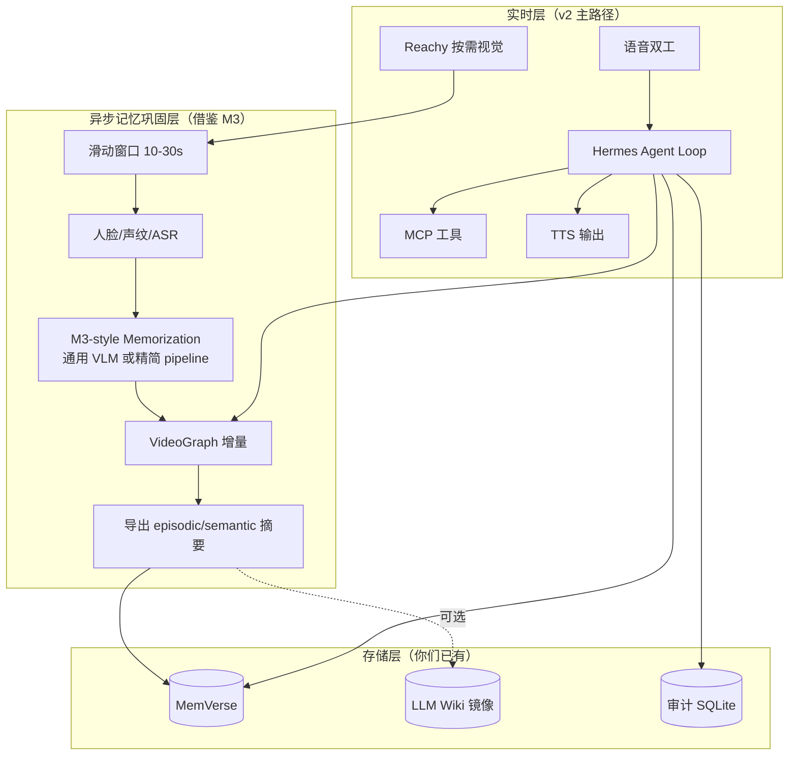

# M3-Agent 深度分析与 v2「共域陪伴版」对标

> **文档版本**：v1.0（2026-05-20）  
> **分析对象**：[ByteDance-Seed/M3-Agent](https://github.com/ByteDance-Seed/M3-Agent)（ICLR 2026，arXiv [2508.09736](https://arxiv.org/abs/2508.09736)）  
> **本地源码**：`research_repos/M3-Agent/`（浅克隆）  
> **关联文档**：[`阶段A_需求驱动版设计.md`](./阶段A_需求驱动版设计.md)、[`v2竞品与同类项目调研报告.md`](./v2竞品与同类项目调研报告.md)、[`个人智能体能力清单与理论成熟度评估.md`](./个人智能体能力清单与理论成熟度评估.md)

---

## 1. 执行摘要（先读这一段）

**你的直觉是对的**：M3-Agent 与 v2 在**问题定义**上高度重合——都是「**持续接收视听输入 → 构建长期记忆 → 基于记忆做多轮推理与回答**」，且官方 explicitly 用 **机器人第一人称视频**（M3-Bench-robot）和个人助理 Demo 来叙事。

但二者在**产品形态与工程目标**上几乎正交：

| 维度 | M3-Agent | 你们的 v2 |
|------|----------|-----------|
| **目标** | 发论文 + 刷长视频 QA 榜 | 可日常使用的共域陪伴助理 |
| **输入** | 离线长视频（30s 切片批处理） | 实时语音 + Reachy 按需视觉 |
| **输出** | 开放域问答文本 | 语音回复 + 工具执行 + Wiki 沉淀 |
| **记忆** | 自研 `VideoGraph`（pickle） | MemVerse + 可选 Wiki 镜像 |
| **推理** | 专用 Control 模型 + 固定 Search 循环 | Hermes 通用 Agent 循环 + MCP |
| **训练** | 两套 RL/SFT 模型（Memorization + Control） | 主要用通用基座 + 规则治理 |

**结论**：

1. **M3-Agent 不是你们的竞品，而是「多模态记忆子系统」的最佳学术参考实现之一。**  
2. **不建议用 M3-Agent 替换 Hermes/MemVerse 主栈**；建议 **抽取其 VideoGraph + 人物等价合并 + 迭代检索** 作为 **Reachy/眼镜感知流的记忆编译层**。  
3. **M3-Bench-robot 可直接作为 Reachy 场景的评测集**（100 段真实机器人视角长视频 QA）。  
4. **差距最大的部分**（语音双工、MCP、Wiki、主动行为、数据主权）M3-Agent **完全没有**，仍需你们自建。

---

## 2. M3-Agent 是什么？

### 2.1 论文与定位

**全称**：*Seeing, Listening, Remembering, and Reasoning: A Multimodal Agent with Long-Term Memory*  
**机构**：ByteDance Seed + 浙大 + 上海交大  
**会议**：ICLR 2026  
**Star**：~1.3k（GitHub `ByteDance-Seed/m3-agent`）

论文核心主张：像人一样处理**实时视觉与听觉**，在线构建**长期记忆**；记忆不仅是情节（episodic），还有语义（semantic）；记忆以**实体为中心的多模态图**组织；收到指令后**多轮迭代检索 + 推理**完成任务。

官方 Demo 标题即为：**「M3-Agent as a personal assistant」**（[YouTube](https://www.youtube.com/watch?v=XUx31cBanfo) / [B站](https://www.bilibili.com/video/BV1h9YpznEx9/)）。

### 2.2 双流程架构（系统心脏）

```
                    ┌─────────────────────────────────────┐
                    │           长期记忆存储              │
                    │   VideoGraph（多模态记忆图 .pkl）    │
                    └──────────────▲──────────────────────┘
                                   │
         ┌─────────────────────────┴─────────────────────────┐
         │                                                   │
┌────────┴────────┐                                 ┌────────┴────────┐
│  Memorization   │  在线/流式处理视频+音频切片        │    Control      │
│  （记忆化）      │  → 人脸/声纹节点 + 情节/语义文本   │  （控制/问答）   │
│                 │  → 写入 VideoGraph                  │  → 多轮 [Answer]│
│  模型：          │                                   │     / [Search]  │
│  M3-Agent-      │                                   │  模型：          │
│  Memorization   │                                   │  M3-Agent-Control│
│  (Qwen2.5-Omni) │                                   │  + vLLM 推理     │
└────────▲────────┘                                 └────────▲────────┘
         │                                                   │
    视频+音频流                                            用户问题
   （30s clip）                                          （benchmark QA）
```

**关键设计**：记忆构建（Memorization）与任务执行（Control）**解耦为两个并行过程**——记忆可以持续写入，问答时只读图检索。这与你们「感知事件化 → 记忆层 → Agent 循环」的分层思想一致。

---

## 3. 记忆系统深度剖析：VideoGraph

源码核心：`mmagent/videograph.py`（~950 行）。

### 3.1 四类节点（Node Types）

| 类型 | 代码 `node.type` | 作用 | 典型内容 |
|------|------------------|------|----------|
| **人脸** | `img` | 视觉实体锚点 | 人脸 embedding（最多 10 个/节点）+ 裁剪图 |
| **声纹** | `voice` | 听觉实体锚点 | 声纹 embedding（最多 20 个/节点）+ ASR 片段 |
| **情节记忆** | `episodic` | 具体发生的事 | 原子事件描述（带 `clip_id` 时间片） |
| **语义记忆** | `semantic` | 抽象知识与关系 | 人物属性、等价关系、情节理解等 |

情节节点按 `clip_id`（30 秒一片）组织，维护 `event_sequence_by_clip` 时间序。

### 3.2 图结构能力

- **边（edges）**：节点间带权重连接；检索时可沿图扩展相关节点。  
- **文本检索**：对 episodic/semantic 节点做 embedding，支持 `search_text_nodes`（余弦相似度，mode: max/sum/mean）。  
- **按 clip 检索**：`retrieve_from_videograph` 支持 `CLIP_n` 模式与 `before_clip` 截断（用于「只看某时刻之前」的评测）。  

### 3.3 人物同一性：Equivalence（与 v2 社会图谱相关）

M3-Agent 最精巧的机制之一：**把不同 clip 里的 `<face_i>` 与 `<voice_j>` 合并为同一 `<character_k>`**。

流程（`refresh_equivalences()`）：

1. 语义节点中找以 `"Equivalence:"` 开头的陈述（由 Memorization 模型生成，如 `Equivalence: <face_1>, <voice_2>`）。  
2. 用 **并查集（Union-Find）** 合并同一人的 face/voice 节点。  
3. 生成 `character_mappings` / `reverse_character_mappings`，供检索时 **back_translate**（人名查询 ↔ ID 查询）。

这与你们未来「关系图谱」需求高度相关，但 M3 只做 **身份对齐**，不做社交礼仪/承诺管理。

### 3.4 Memorization 流水线（源码路径）

```
长视频
  → ffmpeg 切成 30s clips（data/clips/{video_id}/0.mp4, 1.mp4, ...）
  → [可选] memorization_intermediate_outputs.py
        · process_faces（insightface + 聚类）
        · process_voices（speaker diarization + eres2net 声纹 + ASR）
  → memorization_memory_graphs.py（每个 clip）
        · process_video_clip → base64 视频/帧/音频
        · generate_memories（M3-Agent-Memorization 模型）
        · process_memories → 写入 episodic + semantic 节点
  → refresh_equivalences()
  → pickle 保存到 data/memory_graphs/*.pkl
```

**模型**：HuggingFace [`ByteDance-Seed/M3-Agent-Memorization`](https://huggingface.co/ByteDance-Seed/M3-Agent-Memorization)（基于 Qwen2.5-Omni 路线 SFT，训练仓库 [hyc2026/sft-qwen2.5-omni-thinker](https://github.com/hyc2026/sft-qwen2.5-omni-thinker)）。

**Prompt 设计要点**（`mmagent/prompts.py`）：

- 强制用 `<face_i>` / `<voice_j>` 指代，禁止代词。  
- 每条记忆必须是 **原子事件**（一条一事）。  
- Semantic 层包含 5 类：Equivalence、人物属性、人际关系、视频级情节、通用知识。

### 3.5 与认知科学 / 你们 Membrane 的对应

| 认知/框架概念 | M3-Agent | 你们 v2（MemVerse + 设计） |
|--------------|----------|---------------------------|
| Episodic | `episodic` 文本节点 + clip 时间戳 | MemVerse 情节层 / observe_event |
| Semantic | `semantic` 节点 + equivalence | MemVerse 语义层 + Wiki 综合页 |
| Entity | face/voice/character 节点 | MemVerse 实体图 |
| Procedural | **无** | Leaper Skill（v2 延后） |
| Working | **无**（问答时临时检索） | 对话上下文 + STM |

M3 的记忆模型比 Karpathy LLM Wiki **更贴近「共域感知」**，比纯 Markdown Wiki **更结构化**，但 **不可人类直接编辑**（pickle 图）。

---

## 4. Control 系统深度剖析：迭代检索推理

源码：`m3_agent/control.py` + `mmagent/retrieve.py`。

### 4.1 推理循环（固定 5 轮，`total_round` 可配）

```
System: 给定问题 + 已有知识 → 判断能否回答
        → [Answer] + 内容   或   [Search] + 检索 query

Loop (最多 5 轮):
  1. M3-Agent-Control（vLLM）生成 Action + Content
  2. 若 Answer → 结束
  3. 若 Search → retrieve.search(VideoGraph, query)
       · embedding: text-embedding-3-large（OpenAI API）
       · topk clips + 相关 memory 文本
       · 特殊：query 含 "character id" 时走 mem_wise 全图检索
  4. 将 "Searched knowledge: {...}" 追加到对话
  5. 下一轮

最后一轮强制 Answer（允许合理猜测）

评测：GPT-4o 判断预测 vs 标准答案（yes/no）
```

**模型**：[`ByteDance-Seed/M3-Agent-Control`](https://huggingface.co/ByteDance-Seed/M3-Agent-Control)，vLLM `tensor_parallel_size=2`，支持 `enable_thinking`（Qwen 思考链）。

### 4.2 检索策略（`retrieve.py`）

| 机制 | 说明 |
|------|------|
| **向量检索** | query embedding vs 文本节点 embedding |
| **图扩展** | `get_related_nodes` 沿边拉相关节点 |
| **Clip 级聚合** | 节点分数聚合到 30s clip，取 top clips |
| **Back-translate** | 人名/character 映射展开为多条 query |
| **阈值过滤** | `threshold=0.5`，`topk=2`（默认） |

这与 **ReAct / Self-RAG / IRCoT** 同属「检索增强迭代推理」家族，但 **动作空间只有 Answer/Search 两种**，比通用 Agent 工具循环更简单。

### 4.3 训练

Control 模型 RL 训练：[hyc2026/M3-Agent-Training](https://github.com/hyc2026/M3-Agent-Training)（论文报告相对 Gemini-1.5-pro + GPT-4o prompt agent 提升 5–8% accuracy）。

---

## 5. 数据集：M3-Bench（极具对标价值）

| 子集 | 规模 | 特点 | 与你们关系 |
|------|------|------|-----------|
| **M3-Bench-robot** | **100 段真实长视频** | **机器人第一人称**工作/家庭场景 | 与 **Reachy Mini 摄像头视角** 几乎同构 |
| **M3-Bench-web** | 920 段网络视频 | 多样场景 | 泛化评测 |
| 问题类型 | — | 人物理解、跨模态推理、多跳、常识提取 | 可复用为 **记忆+推理验收** |

示例问题（robot）：

- *Why is Abel a little bit angry?* → 需跨 clip 情节 + 人物关系。  
- *What dish is in the red pot?* → 视觉细节。  
- *Which shelf... does Cary's family usually put the wine?* → 跨模态 + 长期偏好。

**建议**：v2 在 Reachy 稳定后，用 **M3-Bench-robot 子集** 做「共域记忆」回归测试（不必追求榜单 SOTA，追求 **你们栈可用率**）。

---

## 6. 工程依赖与运行门槛（务实评估）

### 6.1 环境重量级

| 组件 | 用途 | 备注 |
|------|------|------|
| PyTorch 2.6 + flash-attn | Memorization 推理 | GPU 必需 |
| vLLM 0.8.4 | Control 推理 | 论文默认 2 卡并行 |
| insightface + onnxruntime | 人脸 | |
| 3D-Speaker / eres2net | 声纹 | 需 ModelScope 权重 |
| Qwen2.5-Omni（Memorization） | 记忆生成 | 与你们 Qwen2.5-14B 可共存但重复 |
| OpenAI API | embedding-3-large + GPT-4o 评测 | **非纯本地** |
| ffmpeg | 切片 | |

`setup.sh` 安装链长，**更像研究复现环境，不是开箱产品**。

### 6.2 运行模式：批处理，非实时 Agent

- 视频先 **离线切 30s**，再 **逐 clip 写图**；  
- Control 对 **预生成 pickle** 做 QA；  
- **没有** WebSocket 语音双工、没有工具调用、没有用户在线纠错。

若要接到 Reachy **实时流**，需重写 `streaming_process_video` 为 **滑动窗口 + 增量写图**（论文声称 online，工程默认可跑 offline）。

### 6.3 许可

Apache 2.0（ByteDance）—— 可阅读、修改、商用需注意模型权重许可（查 HuggingFace model card）。

---

## 7. 与 v2「共域陪伴版」逐维对标

对照 [`阶段A_需求驱动版设计.md`](./阶段A_需求驱动版设计.md) 的 A/B/C 类能力。

| v2 能力 | M3-Agent 覆盖 | 相似度 | 说明 |
|---------|--------------|--------|------|
| **A1 语音交互（双语双工）** | — | ☆☆☆☆☆ | 无 TTS/ASR 对话产品路径；仅有 clip 内 ASR 作记忆原料 |
| **A2 共享环境输入（可开关）** | ●●●●○ | ★★★★★ | **核心重合**：视听 → 记忆图；但是 **离线批处理** 非实时 |
| **A3 LLM Wiki 沉淀** | — | ☆☆☆☆☆ | 无 Markdown Wiki；semantic 节点类似但不可 Obsidian 阅读 |
| **A4 主动行为 L0/L1** | — | ☆☆☆☆☆ | 无 Heartbeat/提醒；纯被动 QA |
| **B1 行为一致性档** | — | ☆☆☆☆☆ | 无产品层人格/风格配置 |
| **B2 情感/语气感知** | ○ | ★★☆☆☆ | ASR 有台词；**无语气/prosody** 标签进记忆 |
| **B3 互动节奏感** | — | ☆☆☆☆☆ | 无 |
| **B4 校准/自知边界** | ○ | ★★☆☆☆ | Search 不够会 **最后一轮强制猜**；与你们「不确定就说不知道」**相反** |
| **B5 数据主权** | — | ★☆☆☆☆ | pickle 图 + 依赖 OpenAI embedding；无用户面板/遗忘 UI |
| **B6 跨设备时空连续** | ○ | ★★★☆☆ | 有 clip 时间戳 + `before_clip`；无 device_id / 跨端同步 |
| **C1 跨会话 MemVerse 记忆** | ●（自研图） | ★★★★☆ | **范式相似、实现不同** |
| **C2 MCP 工具** | — | ☆☆☆☆☆ | 无 |
| **C3 L0–L2 治理** | — | ☆☆☆☆☆ | 无 |
| **C4 集成中枢/审计** | — | ☆☆☆☆☆ | 无 trace_id 产品级审计 |

**重合度量化（主观）**：

- **问题定义重合**：~**75%**（共域感知 + 长期记忆 + 多轮推理）  
- **产品能力重合**：~**25%**（仅记忆构建+检索问答骨架）  
- **工程栈重合**：~**15%**（都用 Qwen 系，但集成方式不同）

---

## 8. M3-Agent 做得好的地方（值得借鉴）

### 8.1 实体中心多模态记忆图（P0 借鉴）

**价值**：把「脸 + 声纹 + 事件 + 知识」统一进一张图，比「纯文本 transcript 向量库」更适合 **Reachy 第一人称 + 多人场景**。

**借鉴方式**：

```
observe_event（Reachy）
    → 30s 或更短 window
    → M3-style pipeline（人脸/声纹/ASR）
    → VideoGraph 增量更新
    → 导出摘要写入 MemVerse（双写）
    → Hermes 检索时：memory_search 同时查 MemVerse + Graph
```

不必抛弃 MemVerse；Graph 作为 **多模态编译中间表示**（与 LLM Wiki 作为 **人类可读镜像** 并行）。

### 8.2 Equivalence / Character 合并（P0）

Reachy 场景常见：**看到脸但不知道是谁，听到声音才对应上**。M3 的 `refresh_equivalences` + 并查集是 **可直接移植的算法**，不依赖专用模型。

### 8.3 Answer / Search 迭代检索（P1）

可映射为 Hermes 的 **两个 tool**：

- `memory_search(query)`  
- `memory_answer()`  

或单次 Agent 循环内的 **子技能**。比让模型自由写 tool call 更稳（M3 用 RL 训过）。

### 8.4 原子化 episodic 写入（P1）

Prompt 要求「一条记忆一件事」—— 直接解决记忆臃肿、检索噪声问题。可写入你们的 **记忆门控 schema**。

### 8.5 M3-Bench-robot 评测（P0）

100 段机器人视角 QA = **Reachy 记忆能力的标准考题**。建议 v2 M4/M8 阶段引入 **子集回归**（不必端到端用 M3 模型，用你们栈答题即可）。

### 8.6 Memorization / Control 解耦（P1）

对齐你们架构：

- **Memorization** ≈ 感知层异步「记忆巩固」（类似 OpenClaw dreaming）  
- **Control** ≈ Hermes 在线循环  

对话延迟不会被 30s 记忆写入阻塞。

---

## 9. M3-Agent 的局限（为何不能当主栈）

| 局限 | 影响 | 你们应对 |
|------|------|----------|
| **研究代码，非产品** | 无语音对话、无工具、无 UI | Hermes + 自研薄层 |
| **离线批处理默认** | 不符合实时陪伴 | 改 streaming + 更短 window（5–10s） |
| **依赖 OpenAI embedding** | 违背本地优先 | 换 bge-m3 / Qwen embedding 本地 |
| **最后一轮强制猜** | 与校准原则冲突 | Control 逻辑改为「不足则拒答」 |
| **pickle 不可审计** | 数据主权弱 | 导出 JSONL + Wiki 镜像 |
| **双专用模型** | 部署成本高（2 模型 + vLLM） | v1 用 **通用 Qwen2.5-14B + prompt** 复现 Memorization；Control 用 Hermes 循环替代 |
| **无工具/Wiki/主动** | 不是完整助理 | 你们 v2 其余模块 |
| **GPU 重** | 4070 Ti 16GB 跑 Memorization 需量化 | 视觉记忆可用 **更小 VLM + 文本化再写入** |

---

## 10. 推荐集成架构（M3 在 v2 中的位置）



**原则**：

1. **实时对话永远走 Hermes**，不等待 M3 写图完成。  
2. **M3 管线是后台 job**（每 N 秒或每次会话结束巩固）。  
3. **MemVerse 仍是权威查询入口**；VideoGraph 是 **多模态 enrich**。  
4. **眼镜 v2/v3** 第一人称流 → 同一套 Graph schema，仅改 `device_id=glasses`。

---

## 11. 分阶段落地建议（插入 13 周计划）

| 阶段 | 原 v2 里程碑 | 建议增加（M3 相关） |
|------|-------------|---------------------|
| M0 | 硬件 + Hermes | 跑通 M3 **demo pickle 可视化** `visualization.py`，理解图结构 |
| M4 | Reachy 视觉事件化 | **复用 M3 人脸/声纹中间件**（`face_processing` / `voice_processing`）或等价的 insightface + FunASR |
| M4+ | — | 10s 滑动窗口 **增量 episodic** 写入（简化版 `generate_memories`，先用 **Qwen2-VL 文本描述** 代替专用 Memorization 模型） |
| M8 | 集成测试 | 选 **10 条 M3-Bench-robot** QA 做记忆召回率基线 |
| v2.1 | 眼镜 | 对齐 M3 **第一人称记忆**论文设定；参考 M3-Bench-robot 采集规范 |

**不建议在 v1 做的**：

- 完整训练 M3-Agent-Memorization / Control 模型  
- 替换 MemVerse  
- 全量跑 M3-Bench 刷榜（除非发论文）

---

## 12. 与 MemVerse / Membrane / LLM Wiki 的关系

| 系统 | 与 M3 关系 | 建议 |
|------|-----------|------|
| **MemVerse** | 功能重叠但抽象不同：MemVerse 偏服务化记忆 OS；M3 偏视频图 | **主存 MemVerse**；Graph 作多模态索引 |
| **Membrane** | 五层记忆 + 修订；M3 无修订只有增量写 | 门控/修订规则用 Membrane **思想**，数据可进 MemVerse |
| **LLM Wiki** | M3 semantic 节点 ≈ 自动 Wiki 页原料 | episodic/semantic **定期蒸馏** 到 `wiki/entities/` |
| **Leaper** | M3 用 RL 训检索策略；Leaper 用技能进化 | 长期可把 M3 的 Search 策略 **蒸馏为 Skill** |

---

## 13. 开源与模型资产清单

| 资产 | 链接 | 用途 |
|------|------|------|
| 代码 | https://github.com/ByteDance-Seed/M3-Agent | 管线参考 |
| 论文 | https://arxiv.org/abs/2508.09736 | 设计依据 |
| 主页 | https://m3-agent.github.io/ | Demo、Bench 说明 |
| Memorization 模型 | https://huggingface.co/ByteDance-Seed/M3-Agent-Memorization | 可选专用记忆生成 |
| Control 模型 | https://huggingface.co/ByteDance-Seed/M3-Agent-Control | 可选专用检索推理 |
| M3-Bench 数据 | https://huggingface.co/datasets/ByteDance-Seed/M3-Bench | **Reachy 评测** |
| Memorization 训练 | https://github.com/hyc2026/sft-qwen2.5-omni-thinker | 微调参考 |
| Control 训练 | https://github.com/hyc2026/M3-Agent-Training | RL 参考 |

---

## 14. 最终判断：M3-Agent 对你们意味着什么？

### 14.1 不是

- ❌ 不是一个能 fork 就用的「个人助理产品」  
- ❌ 不能替代 Hermes / MemVerse / MCP / Wiki / 治理  
- ❌ 不是 Reachy 官方维护的「大脑」（官方对话 App 走 Realtime API，见 [`reachy_mini_conversation_app`](https://github.com/pollen-robotics/reachy_mini_conversation_app)）

### 14.2 是

- ✅ **共域感知 + 长期记忆** 方向最系统的 **开源学术论文 + 代码 + 机器人视角 Benchmark**  
- ✅ **VideoGraph + Equivalence** 可直接作为 **Reachy/眼镜感知记忆编译器** 的设计蓝图  
- ✅ **M3-Bench-robot** 可作为你们区别于「聊天机器人」的 **硬核验收**  
- ✅ 验证了 **Memorization / Control 解耦** 在工程上可行  

### 14.3 一句话战略

> **用 M3-Agent 回答「共域记忆怎么建」；用 Hermes + MemVerse + MCP + Wiki + 治理回答「助理怎么长期可用」。**  
> 二者合并，才是你们 v2 的完整故事；只抄 M3 会得到一个 **不会说话、不会干活、不能遗忘** 的论文复现品。

---

## 15. 附录：关键源码文件导读

| 路径 | 读什么 |
|------|--------|
| `mmagent/videograph.py` | Node 类型、equivalence、检索 |
| `m3_agent/memorization_memory_graphs.py` | 写图主流程 |
| `m3_agent/memorization_intermediate_outputs.py` | 人脸/声纹预处理 |
| `m3_agent/control.py` | Answer/Search 多轮循环 |
| `mmagent/retrieve.py` | 向量检索 + character 翻译 |
| `mmagent/prompts.py` | Memorization 五类 semantic 定义 |
| `mmagent/memory_processing_qwen.py` | Qwen 记忆生成 |
| `configs/processing_config.json` | `total_round=5`, `topk=2`, 30s clip |
| `visualization.py` | 调试记忆图 |

---

## 16. 文档维护

- 若 ByteDance 发布 **实时推理服务** 或 **Reachy 官方集成**，在本节更新并修订 §9 局限。  
- 建议在 `research_repos/M3-Agent` 上 pin commit hash 于集成 Adapter 文档。
