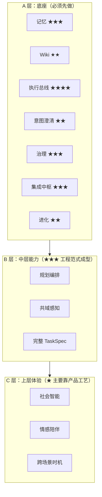

# 个人智能体能力清单与理论成熟度评估

> 整理自：[`底座架构详细设计报告.md`](./底座架构详细设计报告.md)、[`个人Agent定义_能力分层_可行方案.md`](./个人Agent定义_能力分层_可行方案.md)、[`阶段A详细设计.md`](./阶段A详细设计.md)、[`Agent技术学习路线与实践指南.md`](./Agent技术学习路线与实践指南.md)、[`智能体记忆与自进化框架对比分析.md`](./智能体记忆与自进化框架对比分析.md)、[`开源项目下载与分析报告.md`](./开源项目下载与分析报告.md)、[`Karpathy-LLM-Wiki-原理解读.md`](./Karpathy-LLM-Wiki-原理解读.md)、[`分析.log`](./分析.log)、`个人agent助理.pdf`、`agent社区.pdf`  
> 文档版本：v1.0（2026-05-20）

---

## 0. 阅读说明

- **目的**：把零散的设计、对比、PDF 资料合并为「**一个个人智能体到底要具备什么能力**」+「**这些能力当前是否有可靠理论/工程范式支撑**」。
- **能力清单**结合两个视角：  
  - 产品视角（来自《个人 Agent 定义》8 模块、PDF）—— 用户感知到的能力。  
  - 工程视角（来自《底座架构》六层、《开源项目下载与分析报告》6 维度 M/E/I/S/X/B）—— 实现时落到哪一层。
- **成熟度**统一用四档评估：

| 等级 | 含义 |
|------|------|
| ★★★★ | 有公认理论 + 工业级开源实现 + 多家商用案例，可直接选型组合 |
| ★★★ | 工程范式已成型，开源可用，但缺乏统一标准，仍需要团队级裁剪 |
| ★★ | 学术叙事清晰，工业实现局部存在，整体仍处「论文 + 原型」阶段 |
| ★ | 主要是经验法则与产品直觉，缺少系统理论；需自研踩坑 |

---

## 1. 总览：12 项核心能力

按「底层 → 中层 → 上层」依赖排列。前 6 项是《底座架构》里的 A 层「必须先做」，后 6 项依赖底层生长。

| # | 能力 | 产品语言 | 工程层 | 成熟度 |
|---|------|----------|--------|--------|
| C1 | **跨会话持久记忆** | 「越来越懂我」 | Memory Fabric | ★★★ |
| C2 | **知识沉淀与编译**（LLM Wiki / Query Archival） | 「探索能复利」 | Memory Fabric | ★★ |
| C3 | **工具调用与执行总线** | 「能把事做完」 | Execution Orchestration | ★★★★ |
| C4 | **意图理解 + 澄清决策** | 「说不清也能懂、关键事会问」 | Intent Modeling | ★★ |
| C5 | **安全主权与治理** | 「能力强但不越权」 | Governance Plane | ★★★ |
| C6 | **集成中枢与可观测** | （非用户可见，但决定可维护性） | Integration Hub | ★★★ |
| C7 | **自我进化 / 技能学习** | 「教一次就会」 | Evolution Engine | ★★ |
| C8 | **任务规划与多步编排** | 「只交代结果」 | Planner | ★★★ |
| C9 | **共域感知（多模态/具身）** | 「和我在同一现场」 | Perception I/O | ★★ |
| C10 | **社会关系与协作智能** | 「懂人际分寸」 | 上层应用 | ★ |
| C11 | **情感陪伴与人格稳定** | 「有温度不越界」 | 上层应用 | ★ |
| C12 | **跨场景代理与时机感** | 「会判断现在该做啥」 | 上层应用 | ★ |

> **结论先行**：执行总线（C3）已工业化、记忆与治理（C1/C5/C6）有成熟工程范式但无统一理论；意图澄清、进化、感知（C4/C7/C9）处「论文 + 原型」期；社会智能与陪伴（C10–C12）目前主要是产品工艺，理论支撑最弱。

---

## 2. 能力逐项详解

每项按：**用户需求 → 能力拆解 → 理论方法基础 → 代表开源/工业实现 → 当前局限 → 在本项目对应位置**。

---

### C1 跨会话持久记忆（Memory Fabric） ★★★

**用户需求**：它要记住我们共同经历，不只是聊天文本。

**能力拆解**
- 分层：短期 STM / 长期 LTM / 参数化 PM。
- 写入门控：去重、冲突检测、可信度评分、敏感策略。
- 检索：向量 / BM25 / 图 / 时间过滤的混合召回。
- 生命周期：时间衰减、`lifespan_score`、主动遗忘、相关性 Lint。
- 可追溯：来源事件 id、写入时间、门控决策可审计。

**理论方法基础**
- **MemGPT**（Packer 等, 2023）：把上下文窗口当作 OS 内存管理（page in/out），为「Core / Archival / Recall」三分提供理论模型。  
- **认知科学映射**：Episodic / Semantic / Procedural / Working Memory（Tulving 1972；Squire & Kandel）；Membrane 的五层模型即源于此。  
- **ACT-R 激活衰减、Hebbian 共现**：被 Ori Mnemos 等用作「该不该记 / 该不该忘」的可计算规则。  
- **Graph RAG / Temporal KG**：Zep 等用「时间知识图谱」承载事实演化。

**代表实现**

| 项目 | 路线 |
|------|------|
| Letta（MemGPT） | 三层 + memory blocks，最学术化 |
| Zep | 时间知识图谱，企业向 |
| Membrane | 五层 + 修订/衰减，强可审计 |
| MemOS | 多 Cube + 反馈修正，与 Hermes/OpenClaw 联动 |
| Honcho | 持续推理用户表征 |
| MemVerse | 本项目主选记忆中台（见阶段 A） |
| Ori Mnemos | 本地 Vault + RMH，零云 |

**当前局限**
- **没有统一标准**：五家五种 schema，迁移成本高。  
- **「该写什么」仍是经验法则**：门控规则需要业务团队自调。  
- **遗忘策略**理论薄弱：`lifespan_score` 是约定写法，没有公认权重公式。  
- **评测稀缺**：LoCoMo、MemBench 等基准存在，但远未到「像 MMLU 那样可信」。

**本项目对应**：[`底座 §3.4`](./底座架构详细设计报告.md)、[`阶段 A`](./阶段A详细设计.md) 全文、[`对比分析 §3.1–3.11`](./智能体记忆与自进化框架对比分析.md)。

---

### C2 知识沉淀与编译（LLM Wiki / Query Archival） ★★

**用户需求**：好的探索不应消失在聊天记录里，应该「越用越厚」。

**能力拆解**
- 三层：Raw Sources（只读）/ Wiki（LLM 维护）/ Schema（AGENTS.md）。
- 三操作：Ingest（资料整合）/ Query（带引用作答）/ Lint（矛盾、孤儿、陈旧检查）。
- 双通道写入：资料摄入 + **查询沉淀**（好答案归档为新页）。
- 导航：`index.md` 内容目录 + `log.md` 时间线。

**理论方法基础**
- **Vannevar Bush, *As We May Think* (1945)**：Memex 思想——文档间联想路径与文档本身同等重要。  
- **Karpathy LLM Wiki (2026)**：把 Memex 缺失的「谁来维护」交给 LLM，是 **产品/工程模式**，不是数学模型。  
- 与 **RAG（Lewis et al., 2020）** 的差异：RAG 每次重检索；Wiki 把「理解」前移到 ingest。  
- 与 **持续学习 / 知识图谱构建** 学术叙事有交集，但 LLM Wiki 自身 **没有正式理论**。

**代表实现**
- Karpathy 本人 **未提供官方实现**（详见 [`Karpathy-LLM-Wiki-原理解读.md`](./Karpathy-LLM-Wiki-原理解读.md) 第 8 节）。
- 社区：[`equationalapplications/expo-llm-wiki`](https://github.com/equationalapplications/expo-llm-wiki)（SQLite 分层）、[`atomicmemory/llm-wiki-compiler`](https://github.com/atomicmemory/llm-wiki-compiler)、Wikova。
- 本仓库：`research_repos/leaper-agent/skills/research/llm-wiki/SKILL.md`、`research_repos/openclaw/extensions/memory-wiki`。
- **辅助检索**：[qmd](https://github.com/tobi/qmd) 本地 Markdown 混合检索 + MCP。

**当前局限**
- **抽象度高**：Gist 原文写「intentionally abstract」，落地全靠 Schema 与团队自律。
- **Lint 自动化弱**：矛盾/陈旧检测尚无可信工业基线。  
- **规模上限不清**：原文说百源/百页可不用向量库，超出后边界模糊。  
- **与结构化记忆库的边界**：与 Letta/Membrane 类记忆系统的协同模式尚未沉淀为标准。

**本项目对应**：[`底座 §3.4`](./底座架构详细设计报告.md) 「查询沉淀」、`个人Agent定义` 模块 2、[`Karpathy-LLM-Wiki-原理解读.md`](./Karpathy-LLM-Wiki-原理解读.md)。

---

### C3 工具调用与执行总线（MCP） ★★★★

**用户需求**：能稳定使用日历/邮件/文件/浏览器/设备控制等真实工具。

**能力拆解**
- 工具发现、调用、返回结构化结果。
- 鉴权、超时、重试、幂等、补偿。
- 审计：input/output hash、latency、side-effect。

**理论方法基础**
- **Function Calling / Tool Use**（OpenAI 2023、Anthropic Tool Use）：消息中嵌结构化工具描述，已成事实标准。
- **MCP（Model Context Protocol, 2024–）**：Anthropic 主导、Cursor/VS Code 等支持，已是「模型 ↔ 外部世界」插口标准。
- **ReAct（Yao et al., 2022）**：tool loop 的范式起点。

**代表实现**
- [`modelcontextprotocol/servers`](https://github.com/modelcontextprotocol/servers)：官方参考 Server（Filesystem、Git、Fetch、Memory 等）。
- [`MCP Registry`](https://registry.modelcontextprotocol.io/)：可浏览生态。
- Cursor、Claude Desktop、VS Code Copilot 等大量客户端。
- 运行时：Hermes（Python tools loop）、OpenClaw（TS 插件）、LangGraph、AutoGen。

**当前局限**
- **远程 SSE/HTTP 权限模型**仍在演化（多租户、长会话授权）。
- **错误语义不统一**：retryable、side-effect、idempotent 等元数据多数 Server 不返回。
- **本地 stdio 子进程的安全边界**靠运维约束，没有协议级强制。

**本项目对应**：[`底座 §3.3`](./底座架构详细设计报告.md)、[`学习路线 §4`](./Agent技术学习路线与实践指南.md)。

---

### C4 意图理解与澄清决策（L0–L4） ★★

**用户需求**：说不完整也能懂，但关键风险点会问我确认。

**能力拆解**
- 从自然语言 + 场景上下文抽 `TaskSpec`（goal / constraints / preferences / risk / success criteria）。
- 操作分级：L0 查询 / L1 内部写入 / L2 外部通信 / L3 财务·权限 / L4 他人关系。
- 各级固定澄清策略（零确认 / 事后通知 / 草稿确认 / 强认证 / 暂停待授权），**治理层硬执行，不由模型覆盖**。

**理论方法基础**
- **结构化输出**（JSON Schema / Pydantic / function-calling schema）：把模型输出约束为可验证字段，工业成熟。
- **Speech Acts / Mixed-Initiative Dialogue**（Allen, Horvitz 等 1990s–2000s）：人机交互领域有学术积累，但当代 Agent 复用不多。
- **CodeAct / 工具规划论文**：把规划当成代码生成、再由结构化校验把关。

**代表实现**
- 行业上 **没有公认决策树**：L0–L4 是本项目（受 PDF + 分析.log 启发）自定义的分级。  
- 类似思想：Claude 「Constitutional AI」的硬约束、OpenAI Function Calling 的「strict schema」、Hermes 的工具守卫。
- 决策树由 **规则引擎**（如 OPA / cedar / 自研策略文件）+ LLM 分类器组合实现。

**当前局限**
- **「关键节点」的边界**仍依赖经验：哪些算 L3、哪些算 L4，每家产品不一样。
- **过度确认 vs 失控** 的平衡缺乏可量化指标，需要长期 A/B。
- **澄清话术的礼貌度与专业度**仍是产品工艺活。

**本项目对应**：[`底座 §3.2`](./底座架构详细设计报告.md)、`分析.log §2.2`、`个人Agent定义` 模块 3。

---

### C5 安全主权与治理（Governance Plane） ★★★

**用户需求**：它知道我很多事，但控制权始终在我手里。

**能力拆解**
- 数据分级（公开/内部/敏感/极敏感）+ 操作分级（与 L0–L4 对齐）。
- 授权门控：allow / deny / escalate 三态。
- 审计链：决策依据、调用参数、结果、回滚点全程留痕。
- 一键紧急刹车（kill-switch）覆盖执行层。
- 规则编译执行（不依赖 LLM「自觉」）。

**理论方法基础**
- **RBAC / ABAC 经典访问控制**：成熟。
- **Policy as Code**：OPA (Rego)、Cedar (AWS)、Casbin —— 工业成熟，可作为「硬约束」承载。
- **Differential Privacy / 数据脱敏**：在记忆敏感字段处理上有现成框架。
- **AI 安全研究**：Constitutional AI、RLHF、Red-teaming —— 偏模型行为，规则层仍需外挂。
- **Holomime conscience 模式**：rules-as-code + identity stack（本仓库 `research_repos/holomime`）。

**代表实现**
- Hermes 内置注入防护、内容扫描；OpenClaw 提供 `security audit`、`--fix`。
- Membrane 的修订/敏感度域 / Audit log。
- 外部策略引擎：[OPA](https://www.openpolicyagent.org/) / [Cedar](https://www.cedarpolicy.com/)。

**当前局限**
- **LLM 行为级 guardrail**（不被 prompt injection 突破）仍是开放问题。
- **跨组件统一策略下发** 缺少标准（多用自研）。
- **「可解释拒绝」** 体验差：用户常被拒绝但不知原因，需配套对话设计。

**本项目对应**：[`底座 §3.6`](./底座架构详细设计报告.md)、`分析.log §2.2/§3.x`。

---

### C6 集成中枢与可观测（Integration Hub） ★★★

**用户需求**：（不可见）系统能长期维护，组件升级不雪崩。

**能力拆解**
- 各组件经统一事件/契约通信，不直接点对点。
- 数据格式转换、协议适配、版本缓冲。
- `trace_id` 全链路；结构化日志、metrics、tracing。

**理论方法基础**
- **Event-Driven Architecture / Hexagonal Architecture / Ports & Adapters**（Alistair Cockburn）：经典软件架构，直接适用。
- **Schema Registry / Contract Testing**（Pact、Avro/Protobuf 生态）：工业成熟。
- **OpenTelemetry**：日志/指标/追踪三件套标准。

**代表实现**
- 消息总线：NATS、Kafka、Redis Streams（重）；进程内事件总线（轻）。
- API 契约：JSON Schema、Pydantic、TypeScript types（跨语言常用「JSON Schema 单一真相」）。
- 观测：OpenTelemetry + Grafana / Datadog。
- 本仓库 [`阶段 A`](./阶段A详细设计.md) 选「薄层 + Adapter」路径。

**当前局限**
- **AI Agent 专属契约**还没沉淀（`observe_event` / `TaskSpec` / `Skill` 等仍是各家自定义）。
- 中枢「薄 vs 厚」边界经验依赖强：太薄退化为点对点，太厚变性能瓶颈。

**本项目对应**：[`底座 §2.1`](./底座架构详细设计报告.md)、`分析.log §2.1`、[`阶段 A §3–4`](./阶段A详细设计.md)。

---

### C7 自我进化 / 技能学习（Evolution Engine） ★★

**用户需求**：我教一次它就会；纠正一次不再犯。

**能力拆解**（Leaper 六段模型）
- L0 混合召回（BM25 + 向量）。
- L1 经验提炼（从轨迹抽结构化经验）。
- L2 技能生成（聚类 + 合成可复用 Skill）。
- L3 技能演化（合并、淘汰、晋升、漂移检测）。
- L4 用户建模（偏好与决策风格）。
- L5 验证守护（一致性、回归、衰减、**负向验证**）。
- **多样性保持**：防单用户过拟合。

**理论方法基础**
- **Reflexion**（Shinn et al., NeurIPS 2023）：Actor / Evaluator / Self-Reflection 的语言化强化学习闭环 —— 理论简洁，可嵌入。  
- **Voyager**（Wang et al., 2023）：技能=代码模块，自动课程 + 环境反馈 —— 终身学习范式教科书。  
- **Generative Agents**（Park et al., 2023）：记忆→反思→行为仿真。  
- **Self-Refine、Self-Debugging、Toolformer**：自我改进系列论文。  
- **传统 RL**：信用分配、回合奖励等理论可借鉴，但 Agent 场景奖励稀疏、噪声大。

**代表实现**
- Hermes：自动 skill creation / 周期 nudge。  
- Letta Code：`/skill` 显式学习。  
- Acontext：任务完成/失败 → 蒸馏为 SKILL.md。  
- Leaper Agent：六层进化（本项目选型）。

**当前局限**
- **错误学习放大** 是真实风险（`分析.log §3.1`）：缺少标准的「负例生成 + 灰度评测」工具链。
- **技能漂移检测** 没有公认指标。
- **跨用户/跨任务的技能复用** 仍是研究问题（Voyager 在 Minecraft 内做得最好，但开放世界尚未复现）。
- **进化收益量化**（成功率 / 用户修正率 / 时延）每家都自定义，不可比。

**本项目对应**：[`底座 §3.5`](./底座架构详细设计报告.md)、[`学习路线 §5`](./Agent技术学习路线与实践指南.md)、`分析.log §3.1–3.2`。

---

### C8 任务规划与多步编排（Planner） ★★★

**用户需求**：我只关心结果，不想管步骤。

**能力拆解**
- 目标拆解 → DAG（步骤、依赖、重试、补偿）。
- 资源编排：调工具/调子智能体/调人。
- 不确定性：失败重试、备选方案、必要时升级请示。
- 长时任务：跨会话、跨设备恢复。

**理论方法基础**
- **HTN / Classical Planning**：经典 AI 规划成熟但与 LLM 结合有限。
- **ReAct / Reasoning + Acting**（Yao 2022）：当代 Agent 主范式。
- **LLMCompiler、Plan-and-Solve、Tree of Thoughts**：规划增强系列论文。
- **CodeAct**：把规划落到可执行代码，结构化更强。
- **LangGraph 状态机 / DAG**：把规划当图灵机管理。

**代表实现**
- LangGraph、AutoGen、CrewAI、OpenHands、SWE-agent（已在本项目剔除主线，但作为参考）。
- Hermes / OpenClaw 的工具循环。
- 商用：Claude Computer Use、OpenAI Operator 等。

**当前局限**
- **长 horizon 任务**（几十步以上）成功率仍低；多数论文基准都是 ≤10 步。
- **失败恢复**多数靠重试 + 人工，缺乏标准的「补偿事务」语义。
- **多 Agent 协作**有大量论文，但生产部署很少跑得过单 Agent + 工具。

**本项目对应**：[`底座 §3.3`](./底座架构详细设计报告.md)、`个人Agent定义` 模块 4。

---

### C9 共域感知（多模态/具身） ★★

**用户需求**：它和我在同一现场，不用我重复背景。

**能力拆解**
- 多模态：语音（ASR / 说话人识别）、视觉（人/物/场景）、环境（位置、设备、日程）。
- 实体与关系认知：把人、物、地点、事件结构化。
- 情境连续性：持续场景演化，不是单帧。
- 事件化：感知数据 → `observe_event` 流，不直接耦合上层模型。

**理论方法基础**
- **多模态基座模型**（GPT-4o、Gemini、Qwen-VL 等）：理解层成熟，**实时持续感知**仍弱。
- **Embodied AI / Robot Learning**：学术积累深（RT-2、VLA 等），但通用消费场景部署刚开始。
- **Scene Graph / Spatial Reasoning**：经典但 LLM 集成仍粗糙。
- **WebRTC / 边缘推理**：工程链路成熟。

**代表实现**
- Reachy Mini（本项目具身方案）。
- M3-Agent（多模态记忆图）。
- 商用：Humane Ai Pin（失败案例）、Rabbit R1、Meta Ray-Ban、Apple Intelligence。

**当前局限**
- **持续在场（always-on）的隐私 / 功耗 / 体验** 三难，至今无量产成功品。
- **多模态长时记忆** 缺乏统一表示（M3-Agent 等仍在原型期）。
- **实时延迟 + 多设备一致性** 工程难度大。

**本项目对应**：[`底座 §3.1`](./底座架构详细设计报告.md)、`个人Agent定义` 模块 1。

---

### C10 社会关系与协作智能 ★

**用户需求**：它参与我的生活，必须理解人际关系。

**能力拆解**
- 关系图谱：谁与谁是什么关系、敏感点。
- 社交语境：对老板 / 朋友 / 家人切换表达。
- 承诺管理：跟进、致谢、避免失礼。
- 协作记忆：团队共识、分工、决议演进。

**理论方法基础**
- **社会心理学 / 关系图谱研究**：学术存在，未与 LLM 深度结合。
- **Honcho 的 Dialectic 用户建模**：偏「对单用户的持续推理」，群体关系少。
- **企业知识图谱**：与社交语境关系弱。

**代表实现**
- 没有公认开源「社交智能」框架。多数产品（钉钉、飞书 AI 助理）走「企业内规则」路线。
- 学术：Generative Agents 仿真社区，但非生产可用。

**当前局限**
- **理论几乎空白**：「分寸感」「礼貌度」「关系敏感性」尚无可量化指标。
- 隐私边界与「记录他人」的合规风险大。
- 易翻车（错称呼、误判关系），需大量产品兜底。

**本项目对应**：`个人Agent定义` 模块 5（标注为 C 层「长期迭代」）。

---

### C11 情感陪伴与人格稳定 ★

**用户需求**：有温度但不越界，长期稳定可信赖。

**能力拆解**
- 情绪识别与回应。
- 人格一致性（语气、价值立场、风格）。
- 关系节奏感（何时提醒、何时安静、何时倾听）。
- 信任累积。

**理论方法基础**
- **情绪识别 / Affective Computing**（Picard 1997 至今）：学术成熟，但 LLM 集成弱。
- **人格心理学 Big Five**：可作为人格向量，但产品级稳定性靠 system prompt + 持续校准。
- **Constitutional AI / Character.ai 类产品工艺**：实践经验丰富，理论稀薄。

**代表实现**
- SoulClaw（本仓库）：persona drift 检测、身份稳定。
- Character.ai、Replika、Pi by Inflection：产品层成熟，但闭源工艺。
- 学术原型：Generative Agents 的「人格 stub」。

**当前局限**
- **「越界 vs 共情」的边界**主观，常踩雷（Replika 多次公关事件）。
- **长期人格漂移**很难评测。
- **陪伴 vs 依赖** 的伦理问题尚无业界共识。

**本项目对应**：`个人Agent定义` 模块 6（C 层）。

---

### C12 跨场景代理与时机感 ★

**用户需求**：它会判断现在该做什么、什么应延后。

**能力拆解**
- 跨家庭/工作/出行无缝接管。
- 时机预测（push 时机、安静时段）。
- 多任务并发与优先级。

**理论方法基础**
- **Context-Aware Computing**（Schilit 1994 至今）：理论框架成熟，与 LLM 结合还在早期。
- **Time-aware Recommendation / Notification Optimization**：在 push 通知优化领域有数据驱动方法。

**代表实现**
- 苹果 Siri Suggestions、Google Now（已退场）的「主动提示」工艺。
- 当前 LLM Agent 多为 **被动响应**，主动行为靠定时器 + 触发规则。
- 本仓库 Hermes 的 cron 子智能体提供时机骨架。

**当前局限**
- **「不打扰」的算法**没有统一指标。
- **跨设备状态同步** 偏工程问题，不是 AI 问题。
- 真正可用的「主动 Agent」**几乎不存在**，是下一阶段产品赛点。

**本项目对应**：`个人Agent定义` 模块 5/7（C 层）。

---

## 3. 三层能力依赖图

> **关键判断**：**A 层 7 项能力中，只有 C3 是「拿来即用」级；其余都需要团队级裁剪。这是为什么《底座架构》主张「先做底座、再涌现上层」**。

---

## 4. 成熟度小结表（按理论与工程双维度）

| 能力 | 公认理论 | 工业开源 | 商用案例 | 本项目应对策略 |
|------|----------|----------|----------|----------------|
| C1 记忆 | 部分（MemGPT / 认知科学） | 多家（Letta / Zep / Membrane / MemOS / MemVerse） | Letta、Zep 有公开案例 | **MemVerse 主路径 + Adapter 解耦**（阶段 A） |
| C2 LLM Wiki | 无正式理论（Memex 思想 + Karpathy 模式） | 社区刚起步 | 无 | **作为可选镜像层 + 查询沉淀闭环**（底座 v0.2） |
| C3 工具/MCP | 成熟（Function calling、MCP 标准） | 官方 servers + 大量生态 | Anthropic / Cursor / OpenAI 全面采用 | **MCP 优先 + 专有 API 自建 Server**（阶段 B） |
| C4 意图澄清 | 弱（结构化输出有，决策树自创） | 各家自研 | 无统一 | **L0–L4 治理硬执行 + 模型分类**（阶段 B） |
| C5 治理 | 成熟（RBAC/ABAC/Policy as Code）+ 弱（LLM guardrail） | OPA / Cedar / 各家自研 | 企业广泛应用 | **Holomime 思路 + 审计链**（阶段 D） |
| C6 集成 | 成熟（Hexagonal / OpenTelemetry） | 通用 | 通用 | **薄事件总线 + Adapter + JSON Schema**（阶段 A 同步落地） |
| C7 进化 | 部分（Reflexion / Voyager / Self-Refine） | Hermes / Acontext / Leaper | 极少 | **Leaper 六段 + 负向验证 + 灰度**（阶段 C） |
| C8 规划 | 部分（ReAct / CodeAct / LangGraph 范式） | LangGraph / AutoGen / OpenHands | 部分商用 | **由壳承担，自研薄编排**（阶段 B 起） |
| C9 感知 | 部分（多模态基座 + Embodied AI） | Reachy / M3-Agent | 量产很少 | **Reachy Mini + 事件化**（中期） |
| C10 社交 | 缺 | 缺 | 缺 | **延后到 C 层** |
| C11 陪伴 | 弱（Affective Computing） | 闭源工艺为主 | Character.ai / Replika | **SoulClaw 思路 + 长期校准**（C 层） |
| C12 主动时机 | 缺 | 极少 | 几乎无 | **延后到 C 层，按需上 cron + 触发器** |

---

## 5. 给当前阶段的执行建议

结合本项目的《阶段 A 详细设计》，建议把后续工作约束在 **「成熟度 ≥ ★★★ 的能力优先打通」**：

1. **阶段 A（进行中）**：C1 记忆 + C5 治理浅层 + C6 集成中枢 → 必须落地。  
2. **阶段 B**：C3 MCP + C4 澄清决策树 + C8 浅层规划 → 工程化拼装。  
3. **阶段 C**：C7 进化引擎 + C2 查询沉淀 → 需要长时灰度数据。  
4. **阶段 D**：C5 全治理 + C1 生命周期 → 数据足够后回头收口。  
5. **B/C 层（C8–C9）**：可在底座成熟后通过 MCP 工具与多模态插件「接入」，不在主路径自研。  
6. **C 层（C10–C12）**：明确为 **产品体验工艺活**，避免「演示型」资源投入。

---

## 6. 关键参考链接

| 主题 | 链接 |
|------|------|
| MCP 协议 | <https://modelcontextprotocol.io/introduction> |
| MemGPT 论文 | <https://arxiv.org/abs/2310.08560> |
| Reflexion 论文 | <https://arxiv.org/abs/2303.11366> |
| Voyager 论文 | <https://arxiv.org/abs/2305.16291> |
| Generative Agents | <https://arxiv.org/abs/2304.03442> |
| Karpathy LLM Wiki Gist | <https://gist.github.com/karpathy/442a6bf555914893e9891c11519de94f> |
| Letta（MemGPT 演进） | <https://github.com/letta-ai/letta> |
| Honcho | <https://github.com/plastic-labs/honcho> |
| Zep | <https://github.com/getzep/zep> |
| Membrane | <https://github.com/BennettSchwartz/membrane> |
| MemOS | <https://github.com/MemTensor/MemOS> |
| Acontext | <https://github.com/memodb-io/acontext> |
| Ori Mnemos | <https://github.com/aayoawoyemi/ori-mnemos> |
| OPA (Policy as Code) | <https://www.openpolicyagent.org/> |
| OpenTelemetry | <https://opentelemetry.io/> |

---

## 7. 一句话结论

> **「执行总线（MCP）」是当前唯一工业成熟的能力，记忆/治理/集成已有工程范式但需团队裁剪，意图澄清/自我进化/感知仍在论文+原型期，社交/陪伴/主动时机基本只能靠产品工艺**——所以你的「底座优先、上层涌现」决策是符合理论与工程现状的正确选择。
