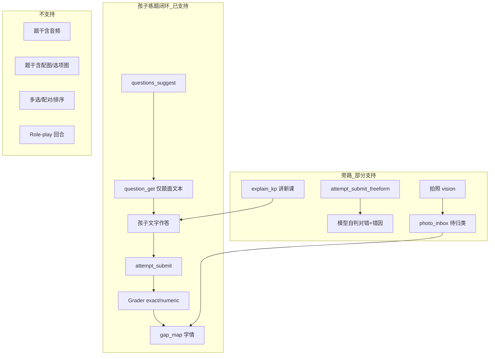

# 问题 4 · 课本多模态 / 非文本题型 — 现状与路线

> **层级**：L1 场景域 · 问题分析（待方案拍板）
> **记录日期**：2026-07-06
> **状态**：🟢 家庭 Alpha 已拍板（路线 A + 课堂活动清单）；38 inbox 已清理
> **前置**：[待办-P1录入与家长对话](./待办-P1录入与家长对话.md)（38 道 inbox 题暂缓处理）
> **代码锚点**：`hujiao_g3_english_parser.py` · `contracts.AnswerType` · `grader.py` · `student_tools.questions_suggest`

---

## 1. 问题是什么（一句话）

**课本里大量习题依赖「听音频、看插图、配对、角色扮演、开放表达」，而当前 Jarvis 推题闭环只支持「纯文字题面 + 文字标准答案（exact / numeric）」；因此这类题无法按课本原貌自动练习，也不应让家长手工补成伪文本题强行入库。**

---

## 2. 课本里实际有哪些题型

沪教三年级英语 PDF 解析器（`hujiao_g3_english_parser.py`）将习题分为两类：

### 2.1 已能自动结构化（进题库）

| 类型 | 提取方式 | 题面形态 | 判分 |
|------|----------|----------|------|
| **Find the rule** | 正则抽对话 Q/A | 「根据问句用英文完整作答」+ 问句文本 | `exact`（小写归一） |
| **Read and choose** | Story 正文 + 编号陈述 | 课文节选 + true/false | `exact`（true/false） |
| 部分句型仿写 | 英文句型行 | 补全句子 | `exact` |

条件：`confidence ≥ 0.85` 且 `expected_answer` 非空 → `import_draft_questions()` 直写 SQLite。

### 2.2 被标为「待人工 / 多模态」（进 inbox，当前暂缓）

解析器 `_MANUAL_EXERCISE` 匹配到的课本活动（每页每种类型至多 1 条占位）：

| 课本活动 | 依赖 | 为何无法自动入库 |
|----------|------|------------------|
| Listen and … | 音频 | PDF 文本层无听力内容；无标准答案 |
| Look, listen and … | 图 + 音 | 同上 |
| Look and write | 插图 | 题干语义在图上 |
| Read and match | 配对 | 非单一 exact 答案 |
| Tick the correct answer(s) | 选项图/文 | 需选项资源 |
| Role-play | 双向对话 | 开放交互，无固定答案 |
| Think and talk / Show and tell | 口头表达 | 开放作答 |
| Do a survey / Make a plan | 任务型 | 开放或结构化弱 |
| Draw / Write and draw | 作图 | 无法 text grader |
| Watch and tick | 视频/动画 | 无媒体管线 |

占位题干形如：`【待人工补全】课本第 N 页 · Listen and…`；答案 `TBD`。**共 38 道（9 个单元）** — 与 inbox 中暂缓项一致。

---

## 3. 产品现在支持什么（端到端）

### 3.1 数据模型

`contracts.Question` / `AnswerType`：

- `exact` — 字符串匹配（英语有大小写/标点模糊）
- `numeric` — 数值容差

**无**：`choice` · `multi_select` · `match` · `audio_prompt` · `image_prompt` · `rubric_open`

### 3.2 推题与判分

| 环节 | 实现 | 限制 |
|------|------|------|
| 选题 | `QuestionBankService.suggest_questions` | 只读 SQLite 文本题 |
| 呈现 | `question_get` 返回 `stem` 字符串 | 8771 聊天 UI **纯文字气泡**，不播音频、不嵌图 |
| 提交 | `attempt_submit(question_id, answer)` | `answer` 为单字符串 |
| 判分 | `Grader.grade()` | 仅 exact / numeric |
| 无题号真题 | `attempt_submit_freeform` | 模型填 `correct` + `error_code`；**不进题库复练** |

### 3.3 多模态能力（有模块、未接入推题）

| 能力 | 模块 | 与课本题关系 |
|------|------|----------------|
| 图像理解 | `vision_understand` / 8771 上传图 | 用于拍作业，**未**绑定 `question_id` |
| TTS | 8771 `/api/tts` | 可读讲解，**未**作为题干附件 |
| ASR | voice 子系统 | 可说答案，但判分仍走 text grader |
| 拍照待归类 | `PhotoTriageService` | 只处理**已批改作业**，不接课本批量 inbox |

---

## 4. 缺口矩阵（课本活动 × 产品能力）

| 课本活动 | 题库结构化 | 孩子端呈现 | 自动判分 | 入学情 | 当前策略 |
|----------|------------|------------|----------|--------|----------|
| 句型仿写 / T-F | ✅ | ✅ 文字 | ✅ exact | ✅ | 已入库 ~26 道 |
| Listen and | ❌ | ❌ | ❌ | ❌ | inbox 占位，**暂缓** |
| Look and write | ❌ | ❌ | ❌ | ❌ | 同上 |
| Read and match | ❌ | ❌ | ❌ | ❌ | 同上 |
| Role-play | ❌ | ❌ | △ freeform | △ | 仅对话即兴，无题库 |
| Think and talk | ❌ | ❌ | △ freeform | △ | 贾维斯可聊，非「做题」 |

---

## 5. 为何「待归类」不能解决多模态题

2026-07-06 已将课本待审题并入 **习题处理 → 待归类**，但该产品入口设计目标是：

- **拍照题**：挂 KP → 记**学情**（`attempt_submit` / freeform）
- **课本文本待审题**：补答案 → 进**题库**（`import_draft_questions`）

对 Listen/Look 类题：

1. 家长无法从 PDF 占位符还原真实题干（缺图/音）；
2. 即使手工填一个英文答案，孩子端仍只有文字气泡，**体验不等于课本**；
3. 强行入库会制造「假题」，推题时孩子看不到图、听不到音。

**因此：38 道 inbox 题暂缓处理是产品决策，不是 UI bug。**

---

## 6. 与架构文档的关系

| L1 原则 | 问题 4 的含义 |
|---------|----------------|
| **AP1 对话主线程** | 听力/口语更适合 `explain_kp` + 对话练习，而非硬塞进 `questions_suggest` |
| **D2 知识点权威** | KP/wiki 已入库；**练习题**可分层：题库题 vs 课堂活动 |
| **C-IO 多模态（L0）** | 能力在感知/语音层已有；**学习域推题契约**尚未扩展 |
| **§7 待归类** | 面向「证据归 KP」；多模态课本题需另定义「活动型练习」或标记 `classroom_only` |

---

## 7. 可选解决路线（分阶段，待拍板）

### 路线 A · 产品声明（成本最低，可立即）

- 在 catalog/wiki 或单元说明标注：**Listen / Look / Role-play 为课堂活动，Jarvis 不推题**；
- inbox 38 题批量 `drop` 或保持冻结；
- 孩子端：用 `explain_kp` + 自由对话练口语，用已入库句型题练书写。

### 路线 B · 文本代理题（低成本，失真）

- 家长或 LLM 把「Look and write」改写成 **纯文字描述题**（exact 答案）；
- 适合少数可脱离插图的题；**不推荐**作为默认流水线。

### 路线 C · 扩展题库契约（中期）

- `AnswerType` 增加 `single_choice` / `multi_choice` / `match` 等；
- `Question` 增加 `media_refs[]`（音频 URL、图片路径）；
- 8771 UI：选项按钮、图片区、播放按钮；
- Grader 扩展选项匹配逻辑。

### 路线 D · 会话型练习（中期，贴合 AP1）

- 不强行入库；Jarvis 按单元脚本 **TTS 播题 + 自由对话**；
- 用 `attempt_submit_freeform` 记口语/听力尝试（粗粒度学情）；
- 需：活动脚本（可由 PDF 解析生成 **教学提纲**，非伪题库题）。

### 路线 E · 多模态判分（长期）

- ASR 转写 + 发音/语义 LLM 评分；
- 看图作答：vision + rubric；
- 成本高，适合口语/听力专项迭代。

---

## 8. 家庭 Alpha 决策（2026-07-06 拍板）

**定位**：学生 Jarvis **不全面代替课堂**；家庭试用版不做高成本多模态推题。

### 8.1 题型处置矩阵

| 课本活动 | 38 题中约 | 家庭 Alpha | 理由 |
|----------|-----------|------------|------|
| Listen and / Look, listen | 9 | **不做 · 清理** | 无课本音频资源，接 TTS 也不是原题 |
| Look and write | 2 | **不做 · 清理** | 题干在插图里，文本化失真大 |
| Read and match | 2 | **不做 · 清理** | 需配对 UI + 判分，非少量开发 |
| Tick the correct | 2 | **不做 · 清理** | 选项多在图上；parser 未抽选项 |
| Role-play | 3 | **不做题库 · 对话替代** | 已有 `explain_kp` + 自由对话；记不进结构化题库 |
| Think and talk / Show and tell | 8 | **同上** | 开放口语，课堂活动 |
| Do a survey / Make a plan | 3 | **不做 · 清理** | 任务型，无标准答案 |
| Draw / Write and draw | 2 | **不做 · 清理** | 无法 text 判分 |
| Watch and tick | 1 | **不做 · 清理** | 无视频管线 |

**结论**：38 道 inbox **占位题全部清理**；不再进入待归类。已入库的 **~26 道文字题**（句型 / T-F）继续推题。

### 8.2 少量开发已做（低成本）

| 改动 | 作用 |
|------|------|
| `classroom_activities.json` | 记录每单元 Listen/Role-play 等页码，**不进题库** |
| Wiki reading KP 附「课堂活动」列表 | `explain_kp` 讲单元时可见，家长/孩子知道 Jarvis 不推这类 |
| `prompts.py` 英语话术一行 | 被问听力/Role-play 时引导对话练句型，不假装推题 |
| `drop_classroom_inbox.py` | 清理历史 38 条占位 |
| 入库改道 | 再跑 PDF 脚本不再往 inbox 塞占位题 |

### 8.3 明确不做（本期）

- 扩展 `AnswerType`（选择题/配对）
- 8771 题干嵌图/播音频
- 听力/口语自动评分
- 把 Listen 硬改成文字代理题入库

---

## 9. 验收口径（问题 4 · 家庭 Alpha 关闭）

| 项 | 标准 |
|----|------|
| 待归类 | 无 38 条课本占位 |
| 推题 | 仅文字 exact 题（已入库） |
| 课堂活动 | `student_data/_classroom_activities/english-g3-hujiao.json` 可查 |
| 讲新课 | Wiki/话术不承诺替代 Listen |

---

## 10. 相关代码索引

| 文件 | 职责 |
|------|------|
| `agent_platform/learning/hujiao_g3_english_parser.py` | PDF 习题分类；`_MANUAL_EXERCISE` |
| `agent_platform/learning/contracts.py` | `AnswerType` · `Question` |
| `agent_platform/learning/grader.py` | 判分 |
| `agent_platform/integrations/hermes/student_tools.py` | `questions_suggest` · `attempt_submit` |
| `agent_platform/learning/question_inbox.py` | 待审文本题（多模态题暂缓） |
| `agent_platform/api/student_chat.py` | 孩子端；vision/TTS 入口 |
