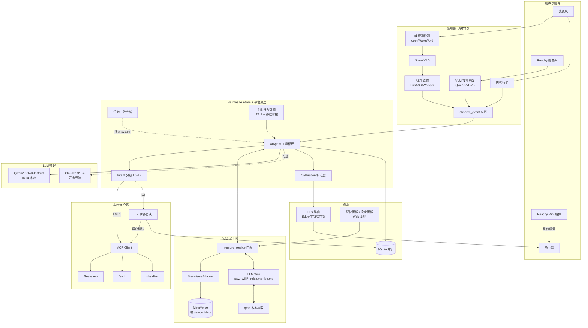

# 阶段 A（共域陪伴版）：需求驱动 v2.0

> **文档版本**：v2.0（2026-05-20，**彻底重写 v1.0**）  
> **关联文档**：[`个人智能体能力清单与理论成熟度评估.md`](./个人智能体能力清单与理论成熟度评估.md)、[`底座架构详细设计报告.md`](./底座架构详细设计报告.md)、[`Karpathy-LLM-Wiki-原理解读.md`](./Karpathy-LLM-Wiki-原理解读.md)、[`阶段A详细设计.md`](./阶段A详细设计.md)（开源融合版，已被本文档替代）  
> **关键产品决策**（用户确认）：
> - **物理形态**：Reachy Mini 桌面机器人（v1 主体）+ 智能眼镜第一人称视角（v2/v3 增量）
> - **语言**：中英双语
> - **用户**：单用户（多用户延后到 v3+）
> - **硬件**：≥ RTX 4070 SUPER Ti（16 GB VRAM）
> - **周期**：12–16 周（本文档按 **13 周** 规划）
> - **「陪伴」本征定义**：**共享用户的环境信息输入**，而非拟人化人设；目标是 **Jarvis 式情境共享**，不是 Samantha 式情感关系

---

## 0. v2.0 与 v1.0 的差异速览

| 维度 | v1.0（文字 CLI 版） | v2.0（共域陪伴版） |
|------|--------------------|-------------------|
| 交互入口 | 文字 CLI | **语音双工（双语 ASR+TTS+VAD+打断）** + CLI 兜底 |
| 感知 | 无 | **Reachy 视觉/音频事件化**（用户可开关；按需触发而非 always-on） |
| 知识沉淀 | 无 | **LLM Wiki 最小骨架**（Ingest + Query，Lint 留接口） |
| 主动行为 | 无 | **L0/L1 基础架构** + 静默时段 + 反馈学习闭环骨架 |
| 校准能力 | 无 | **置信度分级 + 不会就说不会 + 道歉话术**（v1 必备） |
| 数据主权 | 仅审计 | **记忆面板 UI + 一键遗忘 + 数据流可视化** |
| 跨设备时空 | 进程级 | **记忆 schema 带设备 ID + 时间锚定**（v1 不必跨设备，但架构留口） |
| 行为一致性 | 无 | **"它的设定"档**（弱人格、强一致；可见可改） |
| 用户故事数 | 5 | **8** |
| 工程周期 | 5–6 周 | **13 周**（单人）／**10 周**（双人并行） |

---

## 1. 产品定位重述

**「陪伴」≠「人设」**：v1 不追求拟人化、不追求情感深度关系，**追求** "和用户在同一情境里" 的体感 +「能基于共享感知干活」的能力。

参照系：

| 不是 | 是 |
|------|------|
| Replika / Pi（情感陪伴） | Iron Man Jarvis（情境共享 + 干活） |
| Character.ai（角色扮演） | Apple Intelligence（无所不在的环境助理） |
| ChatGPT 桌面版（问答增强） | 早期的 Humane AI Pin / Rabbit R1（但本地优先 + 可改） |

**核心差异化武器**：本地优先 + 数据主权 + 开源可改 + 桌面机器人具身（Reachy Mini）。这是相对 Humane/Rabbit/Friend 等闭源融资公司的真实可守边界。

---

## 2. v1 必备能力清单（最终版）

按来源分 3 类，便于追溯每项决策的依据。

### A 类：用户确认的 4 项必备

| ID | 能力 | v1 实现层次 | 备注 |
|----|------|------------|------|
| A1 | **语音交互（双语）** | 完整：ASR + LLM + TTS + VAD + 流式 + 打断 | 中文用 FunASR / 英文用 Whisper，路由切换 |
| A2 | **共享环境输入** | Reachy 视觉/音频 **事件化**，按需触发；用户可开关 | **不是 always-on**；唤醒/会话期间感知 |
| A3 | **LLM Wiki 知识沉淀** | Ingest + Query 双操作；Lint 仅留接口 | Markdown + qmd 检索，Obsidian 兼容 |
| A4 | **部分主动行为** | L0 信息附带 + L1 弱提醒；静默时段；反馈闭环骨架 | L2/L3 关怀/警示推 v2 |

### B 类：我补充的 6 项（部分降级为「基础架构」）

| ID | 能力 | v1 实现层次 | 备注 |
|----|------|------------|------|
| B1 | **行为一致性** | 持久"它的设定"档 + 简单漂移检测 | 弱人格强一致，避免拟人化 |
| B2 | **多模态/情感感知** | **基础架构**：prosody/视觉特征事件化 + 注入 prompt | 深度回应策略 v2 进化 |
| B3 | **互动节奏感** | **基础架构**：静默时段 + 反馈记录 | 复杂规则 v2 进化 |
| B4 | **校准能力** | 完整：置信度三级 + 不会就说不会 + 道歉话术 | v1 必备 |
| B5 | **数据主权** | 完整：记忆面板 UI + 一键遗忘 + 数据流可视化 | v1 必备 |
| B6 | **跨设备/时空连续性** | 记忆 schema 带 `device_id` + 时间锚定字段 | v1 不必跨设备，但 schema 必须留口 |

### C 类：v1.0 沿用

| ID | 能力 | v1 实现层次 |
|----|------|------------|
| C1 | 跨会话持久记忆 | MemVerse + supersede/tombstone |
| C2 | MCP 工具调用 | filesystem + fetch + obsidian/calendar 三件套 |
| C3 | L0–L2 分级治理 | 含 L2 草稿确认 |
| C4 | 集成中枢薄层 + 审计 | trace_id 全链路 + SQLite append-only |

### 明确不做（v1 范围外）

| 不做 | 延后到 | 原因 |
|------|--------|------|
| 智能眼镜接入 | v2/v3 | 硬件链路不同，单独规划 |
| 多用户 / 声纹识别 | v3+ | 复杂度跳一个量级 |
| 自我进化 / Skill 学习（C7） | v2 | 易「错误学习放大」，需更长灰度数据 |
| 完整 TaskSpec / DAG 编排 | v2 | 工具循环 + 浅 intent 足够 v1 |
| L3/L4 强认证 | v2 | 真实场景与认证通道未明 |
| 主动行为 L2/L3（关怀/警示） | v2 | 需 N2 情感感知成熟才可信 |
| Wiki Lint 自动化 | v2 | 仅留接口；v1 人工触发 |
| 持续视觉 always-on | 不在路线图 | 隐私/功耗/伦理三难 |

---

## 3. v1 价值主张（一句话定义）

> **一个能用语音和你对话、能（在你允许时）看到你看到的、跨会话记得你的、会主动写知识库与轻量提醒、并在不确定时直接说不知道的桌面陪伴助理。**

四个可验证承诺：

| 承诺 | 验证方式 |
|------|----------|
| **共域感知** | Reachy 摄像头/麦开启时，能回答「我桌上那本书是什么」类问题 |
| **跨会话记忆 + 时空感** | 3 天前的偏好仍生效；问"上周项目进度"能正确回顾 |
| **知识自动沉淀** | 一次深度问答 → 提示沉淀 → 写入 Wiki → 下次直接读 Wiki |
| **主动但不打扰** | 静默时段绝不响；L1 提醒可被一句话关闭并持久记住 |

---

## 4. v1 技术架构

### 4.1 架构图

### 4.2 一轮典型交互的数据流

1. **唤醒**：openWakeWord 检测唤醒词 → 拉起 VAD + 摄像头（如用户已开启感知）。
2. **感知融合**：
   - ASR 路由（中/英判定 → FunASR 或 Whisper）→ 文字。
   - Prosody 模块 → `{tone: 疲惫|急促|平静, energy: 0.x}` 标签。
   - 如果用户触发了视觉相关意图 → Qwen2-VL-7B 按需调用（**不持续跑**）。
   - 全部归一为 `observe_event` 进入总线。
3. **召回**：`memory_service.search` 召回相关记忆（带设备/时空过滤）+ 当前 Wiki 索引。
4. **Intent 分级**：L0 直接执行 / L1 事后通知 / L2 草稿确认。
5. **行为档注入**：把"它的设定"档作为 system prompt 注入（不可被对话覆盖）。
6. **LLM 推理**：默认本地 Qwen2.5-14B；显式同意时可走云端。
7. **校准过滤**：
   - 输出带「置信度等级」内部字段。
   - 低置信 → 改写为「我不确定…」「我去查一下」。
   - 与记忆冲突 → 暴露冲突，询问用户。
8. **工具调用**（如需）：MCP Client → 对应 Server。
9. **TTS 输出**：路由到 Edge-TTS（基线）或 XTTS-v2（高质量）。
10. **记忆与审计**：关键事实/偏好/承诺经门控写入 MemVerse；全链路 `trace_id` 写 SQLite 审计。
11. **主动行为评估**：每轮结束，proactive engine 检查是否触发 L0/L1（受静默时段约束）。

---

## 5. 技术栈选型

### 5.1 硬件假设

- GPU：≥ RTX 4070 SUPER Ti（16 GB VRAM）
- 内存：≥ 32 GB
- 存储：≥ 500 GB SSD（模型 + Wiki + 记忆）
- 外设：Reachy Mini（含摄像头/麦克风/扬声器/躯体）
- OS：Linux（推荐 Ubuntu 22.04+）；macOS 备选

### 5.2 软件选型（v1 必须冻结版本）

| 层 | 选型 | 备选 | 选择理由 |
|----|------|------|---------|
| **运行时壳** | [Hermes](https://github.com/NousResearch/hermes-agent) | OpenClaw | 已确认；Python 单栈 |
| **LLM 本地** | Qwen2.5-14B-Instruct INT4（vLLM 或 llama.cpp） | Qwen2.5-7B / Llama-3.1-8B | 16GB VRAM 跑得动 + 中英双强 |
| **LLM 云端**（可选） | Claude Sonnet 4 / GPT-4.x | DeepSeek-V3 | 用户明确同意时调用 |
| **VLM 视觉** | [Qwen2-VL-7B-Instruct](https://github.com/QwenLM/Qwen2-VL) | InternVL2 | 中英双语 + 按需触发 |
| **ASR 中文** | [FunASR / Paraformer-large](https://github.com/modelscope/FunASR) | Whisper-large-v3 | 中文场景显著优于 Whisper |
| **ASR 英文** | [Whisper-large-v3](https://github.com/openai/whisper) | faster-whisper | 英文 SOTA |
| **TTS 基线** | [Edge-TTS](https://github.com/rany2/edge-tts) | piper-tts | 免费 + 双语 + 自然度高 |
| **TTS 高质量** | [GPT-SoVITS](https://github.com/RVC-Boss/GPT-SoVITS) 或 [Coqui XTTS-v2](https://github.com/coqui-ai/TTS) | F5-TTS | 可选；支持音色克隆 |
| **VAD** | [Silero VAD](https://github.com/snakers4/silero-vad) | webrtcvad | 工业标准 |
| **唤醒词** | [openWakeWord](https://github.com/dscripka/openWakeWord) | Porcupine | 离线 + 自定义训练 |
| **流式音频** | [LiveKit](https://livekit.io/) 或 WebSocket 自研 | Pipecat | 本地双工 |
| **记忆后端** | MemVerse（本仓库 `research_repos/MemVerse`） | — | 已选 |
| **Wiki 检索** | [qmd](https://github.com/tobi/qmd) | grep + ripgrep | Karpathy 原文推荐；MCP 兼容 |
| **MCP Client** | [`mcp` Python SDK](https://github.com/modelcontextprotocol/python-sdk) | — | 协议标准 |
| **MCP Servers** | [filesystem](https://github.com/modelcontextprotocol/servers) + [fetch](https://github.com/modelcontextprotocol/servers) + [Obsidian](https://github.com/MarkusPfundstein/mcp-obsidian) | 按场景增 | v1 三件套 |
| **机器人 SDK** | [Reachy SDK](https://github.com/pollen-robotics/reachy_mini)（本仓库 `research_repos/reachy_mini`） | — | 已选 |
| **行为一致性参考** | 本仓库 `research_repos/soulclaw` 的 persona drift 思路 | 自研 | 已有资产 |
| **治理规则** | YAML + Pydantic 校验（v1）→ OPA（v2 升级） | Cedar | v1 不引入 OPA |
| **审计** | SQLite + JSONL | DuckDB | v1 单机足够 |
| **数据主权 UI** | 本地 Web（FastAPI + 简单前端） | Gradio | v1 仅本地访问 |

### 5.3 v1 禁止自研

- 工具协议（必须用 MCP）
- 向量库 / RAG 内核（必须用 MemVerse）
- Agent 主循环（必须用 Hermes）
- ASR/TTS/VLM 模型（必须用开源预训练）
- 进化引擎（v1 完全不做）
- 多通道网关 / Web UI 复杂前端（v1 仅记忆/设定面板）

---

## 6. v1 用户故事（验收剧本）

8 个故事覆盖 A1–A4 + B1–B6 + C1–C4 所有能力。

### US-1：语音唤醒 + 双语切换（A1）

> **唤醒词** → Reachy 拉起 VAD → 用户中文/英文混说 → ASR 路由判定 → LLM 用对应语言回复 → TTS 输出。  
> 验收：唤醒响应 < 500ms；首字 TTS < 1s；中英切换无错。

### US-2：共域视觉（A2 + B2 基础）

> **用户**："看下桌上那本书叫什么名字？"  
> **Agent**：Reachy 抬头看 → 调 Qwen2-VL → "是《思考，快与慢》。需要我帮你做点什么吗？"  
> 验收：视觉调用按需触发非持续；用户可在 UI 一键关闭摄像头；关闭后再问视觉问题，Agent 主动说"摄像头当前关闭"。

### US-3：跨会话偏好 + 行为一致性（C1 + B1）

> **首日**：用户告诉它"我喜欢直接简短的回应"。  
> **3 天后**：关掉进程重启 → 用户提问 → 回复风格仍简短直接。  
> **用户**："给我看下你的设定" → 打开设定面板 → 可见行为档 → 可改。  
> 验收：偏好持久化 + 风格自动应用 + 设定可见可改。

### US-4：知识沉淀（A3）

> **用户**：连续问关于某主题（如 MCP）的 3 个深度问题。  
> **Agent**：在第 3 个回答后，"这次讨论比较有价值，要不要沉淀到知识库？"  
> **用户**："好"。  
> **Agent**：写入 `wiki/concepts/MCP.md` + 更新 `index.md` + 追加 `log.md`。  
> **次日** 用户再问相关 → Agent 优先读 Wiki 而非重新推理。  
> 验收：Wiki 文件产生 + 索引更新 + 下次问答可见复利。

### US-5：主动关怀（A4 + B3）

> **场景 1**：用户连续工作 2 小时（用户主动告知工时或通过日历感知） → Agent 在自然停顿时说："已经 2 小时了，要不要休息一下？"  
> **场景 2**：用户回："我在做正事，别打扰" → Agent 静默该会话剩余时间 + **持久记住**"用户在此类时段不希望提醒"。  
> **场景 3**：用户预设了 22:00–7:00 静默时段 → 该时段绝不主动发声。  
> 验收：主动行为不打扰 + 反馈可关闭 + 静默时段硬遵守。

### US-6：校准 + 道歉（B4）

> **用户**："你之前说的那个版本号是多少来着？"  
> **Agent**：（不确定）"我不太确定，让我查一下" → 工具调用 → "找到了，是 v0.2"。  
> **用户**："其实你之前说的是 v0.3，错了"。  
> **Agent**："抱歉，我记错了。现在更新为 v0.3，原记录已废止。"  
> 验收：低置信明确暴露 + 错了不替自己找借口 + 旧记忆被 supersede + 下次不再返回旧值。

### US-7：数据主权（B5）

> **用户**："你都记了我什么？"  
> **Agent**：（打开浏览器到本地记忆面板）"在这里。你可以按类别筛选、按时间过滤，逐条或批量删除。"  
> **用户** 删除"健康相关"全部 → 该类记忆被 tombstone → Agent 后续不能再用。  
> 验收：面板可访问 + 按类筛选 + 删除生效 + 数据流可视化（"哪条用过云端 LLM"）。

### US-8：跨会话项目状态回顾（C1 + B6）

> **上周**："今天 ProjectX milestone-1 完成；下一步 milestone-2 目标 6 月初出原型。"  
> **本周**："ProjectX 现在到哪步了？"  
> **Agent**："milestone-1 已于上周三（5 月 13 日）完成；milestone-2 目标 6 月初出原型，距今还剩约 2 周。需要我帮你拆下一步吗？"  
> 验收：跨会话状态可召回 + 时间表达以"上周三/还剩 2 周"而非时间戳 + 设备维度元数据正确记录。

---

## 7. 实施计划（13 周）

| 里程碑 | 周期 | 内容 | 主要交付 |
|--------|------|------|---------|
| **M0：硬件 + 壳基线** | 第 1 周 | RTX 4070 SUPER Ti 环境就绪；Reachy Mini 连接验证；冻结 Hermes 版本；本地跑通 Qwen2.5-14B-INT4 | 硬件就绪报告 + Hermes baseline + 单轮文字对话 |
| **M1：语音双工管线** | 第 2–3 周 | openWakeWord + Silero VAD + FunASR/Whisper 路由 + Edge-TTS；流式输入输出；打断检测 | US-1 通过 |
| **M2：记忆 + 时空 schema + 数据主权面板** | 第 4–5 周 | MemVerse 部署 + Adapter + 门面；记忆 schema 加 `device_id`/`ts`/`category`；本地 FastAPI 记忆面板（浏览/筛选/删除） | US-3 / US-7 通过 |
| **M3：LLM Wiki 最小骨架** | 第 6–7 周 | `raw/` + `wiki/` + `index.md` + `log.md`；Ingest + Query 两操作；qmd 检索 | US-4 通过 |
| **M4：Reachy 视觉/音频事件化** | 第 8–9 周 | Reachy SDK 接入；摄像头/麦控制；Qwen2-VL 按需调用；事件总线 + 用户开关 | US-2 通过 |
| **M5：主动行为 L0/L1 + 静默时段** | 第 10 周 | Proactive engine 骨架；静默时段配置；反馈学习写记忆 | US-5 通过 |
| **M6：MCP 工具 + L0–L2 治理** | 第 11 周 | MCP Client 接 filesystem/fetch/obsidian；草稿确认 UI | 工具与外发跑通 |
| **M7：校准 + 行为一致性档** | 第 12 周 | Calibration 后处理；置信度暴露；道歉话术；行为档注入 + 漂移检测 | US-6 / US-3 后半 通过 |
| **M8：集成测试 + 7 天自用** | 第 13 周 | 8 个 US 端到端回归；连续 7 天自用 + bug 修复 + 录屏 | v1 签字交付 |

**双人并行可压缩到 10 周**：M2/M3 并行（记忆与 Wiki）+ M4/M5 并行（感知与主动）。

---

## 8. 验收标准

### 功能维度（必须全部通过）

1. ✅ 8 个 user story 全部可重复演示。
2. ✅ 语音唤醒响应 ≤ 500 ms；首字 TTS ≤ 1 s；中英切换准确。
3. ✅ 视觉/麦克风的用户开关 100% 生效；关闭后绝无视觉调用。
4. ✅ 外发动作（L2）100% 经过草稿确认。
5. ✅ 跨会话偏好与项目状态可重复召回（≥ 3 天）。
6. ✅ 记忆面板 UI 可访问；删除生效；数据流可视化显示哪些调用走云端。
7. ✅ 低置信回答必带"不确定/我去查"标识，禁止编造。
8. ✅ 静默时段硬遵守；用户拒绝后该类提醒被记住。
9. ✅ Wiki Ingest 触发后产生新页 + 更新 index + 追加 log；Query 时优先读 Wiki。
10. ✅ 行为档可见可改；同一问题在不同会话风格一致。

### 使用维度（验证 v1 有真实价值）

11. ✅ 作者本人连续 **7 天** 每天 ≥ **5 次** 主动语音交互。
12. ✅ ≥ **3 个高频场景** 比"打开电脑用文字 GPT" 更顺手。
13. ✅ 至少 1 次"知识沉淀 → 后续直接受益"的复利体验。

### 工程维度

14. ✅ 同一 `trace_id` 可串联：观测 → intent → LLM → 工具 → 记忆 → 审计。
15. ✅ MockMemAdapter 与 MemVerseAdapter 可切换，业务代码无 diff。
16. ✅ 全程**无密钥泄露** 到日志/审计/记忆。
17. ✅ 本地 LLM 推理时延：单轮 < 3 s（短 prompt + 流式）；VLM 调用 < 5 s。

---

## 9. 风险与对策

| 风险 | 触发场景 | 对策 |
|------|---------|------|
| 语音链路时延爆炸 | 流式 TTS/ASR 调度差，导致对话像"对讲机" | 早期 M1 即做时延基准；用 LiveKit 而非自研管线 |
| Qwen2.5-14B 跑不动或质量不够 | 4070 SUPER Ti 显存不足 / 双语长上下文质量退化 | 备用 7B；备用云端 Claude；INT8 vs INT4 切换 |
| Reachy Mini SDK 不稳定 | 摄像头/麦/动作驱动有 bug | 早期 M0 验证；准备摄像头/麦的 USB 备用方案 |
| 主动行为引起反感 | L1 提醒频率失控 | 一句话关闭 + 默认极保守 + 反馈学习降权 |
| 数据主权面板被忽略 | 用户觉得"麻烦不看" | UI 极简（不超过 3 个 tab） + 每周一次自动摘要弹窗 |
| Wiki 沉淀触发疲劳 | 每次都问"要不要沉淀" | 默认静默 + 用户可显式 `/沉淀` 命令 + 触发阈值可调 |
| 校准能力被模型自身突破 | LLM 还是会编 | 输出后处理 + 高敏字段（数字/日期）必须有 source |
| 单人 13 周排不下 | 工程量超预算 | M5/M6 可并入 M7（牺牲主动行为 L1，仅留 L0） |

---

## 10. v2 / v3 路线图

| 阶段 | 主题 | 新增能力 |
|------|------|---------|
| **v2** | 第一人称视角 + 深化感知 + 浅进化 + L3 | 智能眼镜接入（第一人称视觉流）；情感感知策略库（B2 深化）；互动节奏规则深化（B3 深化）；主动行为 L2 关怀；Wiki Lint 自动化；轻量反思（C7 启动）；L3 强认证 |
| **v3** | 多用户 + 仪式性 + 跨设备 | 声纹识别 + 多用户隔离；早安/晚安/周回顾；手机/电脑作为第二设备；完整跨设备记忆同步 |
| **v4+** | 上层体验 | 复杂规划（C8 升级）；社交协作（C10）；按需细化 |

---

## 11. 与原文档关系

| 原文档 | 处理 |
|--------|------|
| [`阶段A详细设计.md`](./阶段A详细设计.md)（开源融合版） | **70% 工程设计直接复用**（contracts / gate / audit / Adapter / memory_service 门面 / MemVerseAdapter）；其作为「工程地基参考」，不作为 v1 验收依据 |
| 本文档 v1.0（文字 CLI 版） | **被本 v2.0 彻底替代** |
| [`底座架构详细设计报告.md`](./底座架构详细设计报告.md) | 仍是六层架构总纲；本文档是其 v1 实例化 |
| [`Karpathy-LLM-Wiki-原理解读.md`](./Karpathy-LLM-Wiki-原理解读.md) | A3 / Wiki 部分的理论依据 |
| [`个人智能体能力清单与理论成熟度评估.md`](./个人智能体能力清单与理论成熟度评估.md) | 12 项能力的选型依据 |

---

## 12. 一句话总结

> **v1 不再是「文字版可用的最小 Agent」，而是「桌面机器人形态、能语音对话、能在你允许时看到现场、能自动沉淀知识、会保守地主动开口、不确定就老实说不知道、记得你三天前说过的话、随时可以查看与删除它记得的一切」的共域陪伴助理**——13 周可达，13 项验收标准可签字，所有开源依赖来源明确，无任何「靠演示效果"撑场面"」的占位项。
