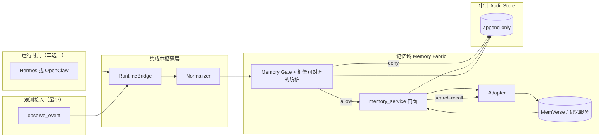

# 阶段 A：可追溯记忆底座 + 集成中枢骨架 — 详细设计

**文档版本**：v1.1  
**关联文档**：《底座架构详细设计报告》（v0.2）第 2、3.4、6、8 节  
**定位**：在总架构之下，规定**阶段 A 唯一交付边界**、**实现架构**、**技术选型**与**可验收的实施计划**。未写入本文档的能力（TaskSpec、MCP 全链路、澄清树、进化闭环）默认不在阶段 A 范围内。

**v1.1 相对 v1.0 的策略调整**：**优先融合参考框架的可复用能力**（Hermes / OpenClaw / MemVerse），**避免自研与上游重复的「迷你运行时、迷你 RAG」**；自研范围收敛为 **契约 + 门控 + 审计 + Adapter 胶水**，保证质量与演进边界清晰。

---

## 1. 为什么要单独写「阶段 A」

总架构描述了六层能力与集成中枢的职责，但没有回答：**第一期工程里先出现哪些进程、哪些接口、哪些仓库目录**。若直接从「接 Hermes + 接 MemVerse」开工，容易绕过中枢形成点对点调用，后期再抽 Hub 会大规模重构。

阶段 A 的目标可以用一句话概括：**先让「观测 →（选定运行时壳）→ 记忆（带门控）→ 召回 → 审计 → 纠正」成为唯一合法路径**；其中**运行时与会话循环优先复用 Hermes 或 OpenClaw**，**长期记忆与检索优先复用 MemVerse（或服务化路径）**，差异通过 **Adapter** 隔离；**Stub/Mock 仅用于 CI 或离线演示，不作为长期主开发路径**。

---

## 2. 阶段 A 范围与非目标

### 2.1 范围内（必须交付）

| 能力域 | 交付物 |
|--------|--------|
| 运行时壳（必选其一） | **Hermes** 或 **OpenClaw** 作为会话、消息与（可选）工具循环的承载；不在阶段 A 自研 Agent 主循环 |
| 集成中枢薄层 | 在壳之上的 **统一契约 + 事件入口**（工具/插件/回调挂载点），**复用**框架既有路由/会话 ID；版本化 JSON 契约 |
| 观测接入（最小） | 将「聊天 / CLI / payload」规范为 `observe_event`，经壳进入记忆链路 |
| 记忆与知识层（最小） | **MemVerse（或既定记忆服务）为主路径**，经 `MemoryPort` + **Adapter** 访问；业务与壳侧代码 **禁止** 直连 MemVerse 内部模块 |
| 记忆门控（MVP） | 写入前薄管道：**尽量对齐 Hermes 既有记忆防护能力**，补产品级去重/冲突/敏感策略；拒绝原因可审计 |
| 审计 | 全链路 `trace_id`；门控与记忆写读关键步骤 append-only 可查（可与框架日志字段对齐） |
| 误记忆纠正 | 废止 / supersede / 修正；召回语义一致；审计可追溯 |
| 验证方式 | 契约测试 + **MemVerse 实现**与 **CI 用 Mock Adapter** 双跑；证明替换 Adapter 时壳与编排无改或仅配置变更 |

### 2.2 范围外（明确不做，避免范围蔓延）

- **意图层**：不实现完整 `TaskSpec`、澄清决策树（L0–L4）、风险分级自动化（留给阶段 B）。
- **执行编排层**：不实现 DAG、不强制 MCP Client 全量接入（阶段 B）；阶段 A 仅可预留 `executor_service` 空壳或 noop。
- **自我进化层**：不接 Leaper、不生成 Skill（阶段 C）。
- **治理全量**：不接 Holomime 运行时；阶段 A 仅在门控/审计中体现「可规则化」的雏形（如敏感词表），不把 conscience 编译器并入本期。
- **具身**：不接 Reachy；观测事件可用手工或脚本模拟。
- **自研完整 RAG/向量库**：禁止；检索与图记忆以 **MemVerse（或框架已对接的记忆引擎）** 为准。
- **Stub 当默认后端**：不允许；**Stub/Mock 仅限 CI、契约测试与无后端环境的演示**。

---

## 3. 阶段 A 要实现的目标（细化说明）

### 3.0 融合优先原则（实施约束）

1. **记忆与检索**：以 **MemVerse 部署实例**（或团队冻结版本的 orchestrator/API）为事实来源；Adapter 仅封装 HTTP/子进程调用与错误映射。  
2. **运行时**：在 **Hermes** 与 **OpenClaw** 中 **必选其一** 作为壳；集成中枢体现为该仓库内的 **薄封装模块**（工具函数、plugin、或最小 SDK 调用），而非并行维护第二套 Agent 引擎。  
3. **可复用能力主动对齐**：例如 Hermes 侧已有会话存储、记忆工具、注入防护——**优先接线后再补缺口**，避免重写。  
4. **自研边界**：`contracts`（Pydantic/TS types）、`gate`（产品策略）、`audit`（旁路存储）、`adapters/*`；**不自研** embedding、图构建、主 Agent 循环。

### 3.1 可追溯（Recall + Provenance）

- 每条进入长期记忆候选的内容带有：**来源事件 id**、**写入时间**、**门控决策**、**内容摘要或 hash**（按需脱敏）。
- 给定用户可见事实，能通过审计或记忆记录解释：**最早写入来自哪次 observe**、是否经过纠正。

### 3.2 可纠正（Correct / Tombstone）

- 用户或运维能发起「纠正」：旧记录不再作为有效召回结果，或被子记录显式替代。
- 纠正操作本身写入审计，满足合规与排障需求。

### 3.3 集成中枢可演进（Adapter 隔离）

- **编排与契约层**只依赖稳定的 `MemoryPort`、`AuditPort`、以及与选定壳对接的 `RuntimeBridge`（命名可按实现调整）。
- **MemVerse 与 CI Mock** 的差异全部收敛在 `adapters/memory_*.py`（或 TS 等价路径）；**可选**保留极简 **SQLite 旁路**仅用于审计或离线演练，不作为与 MemVerse 对等的「第二记忆真理源」。
- 验收时能通过配置切换 **MemVerseAdapter** 与 **MockMemAdapter**，**壳与 memory_service 编排无 diff 或仅改依赖注入配置**。

### 3.4 可观测（阶段 A 最小集）

- 结构化日志字段：`trace_id`、`component`、`adapter_version`、`event_type`、`outcome`。
- _metrics 可选；阶段 A 不强求 Prometheus，但日志字段需预留与追踪对齐。

---

## 4. 阶段 A 实现架构（长什么样）

### 4.1 逻辑视图：只在阶段 A 激活的部件

在总架构六层中，阶段 A **实质激活**的是：

- **感知接入层**：仅保留「事件化」最小子集（文本/脚本 → `observe_event`），可由壳的会话消息转换而来。
- **执行编排层（浅）**：复用选定壳的 **会话循环 / 消息泵**；不自研 DAG。
- **集成中枢层**：**薄层**——契约、事件入口、与壳的挂载点（工具/plugin），**复用**框架路由与任务/会话 ID。
- **记忆与知识层**：**MemVerse 为主** + `memory_service` 门面 + Adapter。
- **安全与主权治理层**：**横向浅色切入**——门控策略与审计；可叠加 Hermes 既有记忆/注入相关能力。

未激活（仅占位或 noop）：完整 TaskSpec、MCP 全量、进化引擎、具身、完整 Holomime。



### 4.2 核心路径：observe → memory → recall

1. **Ingress**：用户消息或脚本产生 `observe_event`（`trace_id` 与壳的 session/task id 对齐或映射）。
2. **RuntimeBridge**：进入规范化（Normalizer），复用壳提供的上下文（如 profile、会话历史指针）。
3. **Gate**：对候选 `MemoryWriteRequest` 执行 MVP 门控（可与 Hermes 记忆写入守卫顺序衔接）。
4. **Write**：`memory_service.write` → **仅经 MemVerse Adapter** 写入记忆服务。
5. **Recall**：`memory_service.search` → 同 Adapter 调 MemVerse 检索 API。
6. **Audit**：门控结果、写入/检索摘要写入审计存储；日志字段与壳对齐便于联查。

### 4.3 与 Hermes / OpenClaw 的边界（阶段 A 必须明确）

- **必须二选一**作为阶段 A 主壳；文档与仓库须写明选型及版本 pin。
- **业务与插件代码**只调用本仓库 **memory_service / ingest API**，**禁止**直接依赖 MemVerse Python 包路径或手写 HTTP 散落各处。
- **OpenClaw 路径**：集成表现为 **TypeScript 插件或网关侧调用**，经 **Adapter** 调 MemVerse（可用 `httpx` 等价层或 Node `fetch`）；契约可与 Python 侧 **JSON Schema 对齐** 以保持跨语言一致。
- **Hermes 路径**：集成表现为 **工具函数或内部模块**，在同一 Python 进程内调 `memory_service`。

---

## 5. 技术选型与开发框架

### 5.1 运行时壳（必选其一）

| 路径 | 适用 | 阶段 A 复用内容 |
|------|------|-----------------|
| **Hermes** | Python 团队、与 MemVerse/Leaper 同栈 | `AIAgent` 会话与工具循环、会话存储与既有 memory 相关工具/守卫、Gateway/ACP 若需要 |
| **OpenClaw** | 已投入 Gateway/插件/TS 栈 | Gateway 消息与控制面、插件体系、通道与配置模型 |

**禁止**：在阶段 A 并行维护两套壳作为「主路径」；另一套可作技术预研，**不进入签字验收**。

### 5.2 记忆后端（主路径）

| 组件 | 角色 |
|------|------|
| **MemVerse** | 长期记忆与检索的**默认实现**；以进程外服务或子进程方式部署，经 Adapter 调用 |
| **MockMemAdapter** | 仅用于 **CI、契约测试、无 MemVerse 环境**；须在 README 标明非生产路径 |

### 5.3 自研与融合边界

| 类别 | 策略 |
|------|------|
| **融合（抽取接入）** | Agent 主循环、会话、框架自带记忆防护与日志形态 |
| **自研（薄）** | `contracts`、统一 `memory_service` 门面、`gate` 产品规则、`audit` 旁路存储、`adapters/*` |
| **禁止自研** | 向量库、图 RAG 核心、替代 MemVerse 的「简化记忆库」作为主真理源 |

### 5.4 核心依赖（按壳分支）

**Hermes + Python 侧**

| 用途 | 建议库 | 备注 |
|------|--------|------|
| 契约 | `pydantic` v2 | 与现有 Python 生态一致；导出 JSON Schema 供 OpenClaw 对齐 |
| 配置 | `pydantic-settings` / `yaml` | 区分 `memverse_base_url`、壳路径等 |
| 调 MemVerse | `httpx` | Adapter 内封装 REST/本地 API |
| 审计 | `sqlite3` 或 JSONL | 旁路，与 Hermes 日志并存 |
| 测试 | `pytest` | MemVerse 可用 testcontainer 或 Mock |

**OpenClaw + TypeScript 侧（若选此壳）**

| 用途 | 建议 |
|------|------|
| 契约 | TypeScript 类型 + 从 Schema 生成或与 Python **同一 JSON Schema** 双向校验 |
| 调 MemVerse | `fetch` / `undici` 封装在 `adapters/memory_memverse.ts` |
| 审计 | 轻量 SQLite（better-sqlite3）或写文件；与 Gateway 日志字段对齐 |

### 5.5 不建议阶段 A 引入的

- 自研消息总线（Kafka 等）替代壳自带路由（除非壳无法满足最低需求）。
- 完整 OpenTelemetry：可延后；**先统一 `trace_id` + 结构化日志**。

### 5.6 推荐开发顺序（融合优先）

1. **冻结壳与版本**（Hermes 或 OpenClaw），跑通官方最小 demo。  
2. **部署/拉起 MemVerse**，实现 **MemVerseAdapter**（`write/search/correct` 最小集）。  
3. 在本仓库实现 **memory_service 门面 + Gate + Audit**，挂载到壳（工具/plugin）。  
4. 补齐 **Mock Adapter + pytest**，保证 CI 不依赖真实 MemVerse。  
5. 文档与验收以 **MemVerse 真路径** 为主演示；Mock 仅证明契约稳定。

---

## 6. 接口与数据契约（摘要）

### 6.1 统一追踪

- **`trace_id`**：UUID string，从观测进入系统开始贯穿门控、记忆、审计。
- **`event_id`**：观测事件唯一 id。

### 6.2 `observe_event`（阶段 A 最小字段）

- `event_id`, `ts`, `source`（如 `cli` / `chat` / `demo`）
- `modality`（默认 `["text"]`）
- `payload` 或 `text`（二选一约定）
- `trace_id`

扩展字段（可选、向后兼容）：`entities`, `scene`, `raw_refs`（与总架构 3.1 对齐）。

### 6.3 `MemoryWriteRequest` / `MemoryRecord`

- 写入请求至少包含：`content` 或结构化字段、`kind`（`fact` / `episode` / `preference` 等枚举可先粗粒度）、`trace_id`、`source_event_id`。
- 存储记录包含：`record_id`、`content_hash`、门控元数据、`created_at`、**`supersedes` / `status`**（active | tombstoned）。

### 6.4 `GateDecision`

- `allowed: bool`
- `reason_code`（枚举或字符串）
- `details`（调试级，不进用户侧）

### 6.5 集成入口 API（与壳对齐）

- **逻辑能力**仍对应总架构的 `integration_hub.emit/route()`：**事件进入 → 规范化 → 分发到记忆管道**。  
- **实现形态**依壳而定：Hermes 侧可为 **Python 模块 + 工具注册**；OpenClaw 侧可为 **plugin 入口函数**。  
- **对外禁止**直接暴露 MemVerse 客户端类型；仅暴露 `ingest_observe_event(...)`、`memory_write(...)`、`memory_search(...)` 等门面方法（命名可调整）。

---

## 7. 建议代码目录结构（单仓库示例，融合版）

以下示例以 **单仓承载「契约 + 记忆门面 + Adapter」**；**Hermes / OpenClaw / MemVerse** 以 **子模块、git submodule 或 monorepo 邻域** 引用，**不复制**其内核源码进本仓（仅允许 **薄封装与 fork 专用分支** 若许可证允许）。

```
platform/                          # 或 agent_base/
  contracts/                       # 共享 JSON Schema / pydantic / TS types
  memory/
    service.py                     # MemoryService 唯一入口（Hermes 进程内）
    gate.py                        # 产品门控 + 可调用 Hermes 既有守卫
    ports.py                       # Protocol: MemoryBackend
  adapters/
    memory_memverse.py             # 主路径：调 MemVerse HTTP/子进程
    memory_mock.py                 # CI / 无环境时使用
  audit/
    store.py                       # append-only
  integrations/
    hermes/
      tools_memory.py              # 注册为 Hermes 工具或回调
      runtime_bridge.py            # session/task id 映射 trace_id
    openclaw/                      # 若选 OpenClaw 壳
      plugin_memory.ts             # 插件入口
      memory_client.ts             # 调本仓 REST 或直连 Adapter（二选一，择一清晰）
  apps/
    cli_demo.py                    # 可选：不依赖壳的纯门面演示（仅用 Mock）
  tests/
    test_contracts.py
    test_gate.py
    test_adapter_memverse.py       # 集成测试，可对 MemVerse 打标 @integration
    test_adapter_mock.py
```

说明：**壳内业务代码**只依赖 `memory.service` 门面与 `integrations/<shell>/` 暴露的注册入口；**禁止**在插件内散落 `httpx.get(memverse...)`。**可选**：增加极薄 **FastAPI** 层，使 OpenClaw 插件只调本仓 HTTP，便于跨语言隔离。

---

---

## 8. 记忆门控 MVP 规格

阶段 A 至少实现下列中的 **三项**，且 **去重 + 审计** 为强制项：

| 能力 | MVP 实现建议 |
|------|----------------|
| 去重 | `content_hash`；若 MemVerse 侧已有去重/合并策略则 **优先沿用文档化行为**，本层只补产品级规则 |
| 冲突检测 | 同一 `subject_key` 下新旧陈述冲突 → `review` 或拒绝 |
| 敏感策略 | 可配置关键词或正则；**与 Hermes 记忆注入扫描等能力可叠加**（若选 Hermes） |
| 可信度占位 | 字段 `confidence` / `source_tier` 写入记录，供后续 lifespan 使用 |

---

## 9. 验收标准（阶段 A 签字用）

以下为 **必须全部满足** 方可宣布阶段 A 完成：

1. **端到端路径（主路径）**：在**选定壳**上可重复演示：用户消息或工具触发 → gate → **MemVerse** 写入 → 检索返回；Mock 路径仅作辅证。
2. **审计**：同一 `trace_id` 可串联门控与写入；纠正操作有独立审计类型；与壳的 session 日志可互查（字段约定写进 README）。
3. **纠正**：错误事实写入后可纠正，再次 search 不再以错误事实为「当前真值」（tombstone/supersede 语义与 MemVerse/Adapter 行为一致并文档化）。
4. **Adapter 隔离**：`MemVerseAdapter` 与 `MockMemAdapter` 通过相同 `MemoryPort` 测试；**记忆门面编排代码**（如 `memory/service.py` 或 TS 中等价模块）**不随 Adapter 切换而改**。
5. **文档**：写明**壳 + 版本**、**MemVerse 部署方式**、Adapter 环境变量；与本文「范围与非目标」、目录结构一致。

---

## 10. 实施计划

### 10.1 里程碑与周期（单人全职量级，融合优先）

| 里程碑 | 内容 | 建议时长 | 交付物 |
|--------|------|----------|--------|
| **M0** | **冻结壳（Hermes 或 OpenClaw）+ 版本**；跑通上游官方最小示例 | 2–3 天 | 选型记录、可运行 baseline |
| **M1** | 契约包：`ObserveEvent`、`MemoryWriteRequest`、`GateDecision`、JSON Schema（可与 TS 共用） | 2–3 天 | `contracts/` + pytest |
| **M2** | **部署 MemVerse**；实现 **MemVerseAdapter**（`write/search/correct` 最小集）；`memory_service` 门面 | 4–7 天 | **主路径端到端**（可先 CLI 调门面再挂壳） |
| **M3** | **Gate**（去重必选 + 至少一项冲突/敏感）+ 与壳侧记忆防护对齐说明 | 3–5 天 | gate 测试 + 文档 |
| **M4** | **AuditStore**；`trace_id` 与壳 session 对齐 | 2–4 天 | 可追溯脚本 |
| **M5** | **integrations/<shell>/**：挂载工具/plugin，壳内完成「对话 → 写入 → 检索」演示 | 3–5 天 | 签字主演示 |
| **M6** | **MockMemAdapter** + CI；纠正语义与集成测试 | 2–4 天 | 绿 CI、Adapter 切换不换门面 |

**合计**：约 **3–6 周**（含 MemVerse 部署与学习成本）。两人并行可压缩 **M1/M3/M4** 重叠。

### 10.2 每周节奏建议（融合版）

- **第 1 周**：M0 + M1；并行熟悉 MemVerse API。  
- **第 2–3 周**：M2（MemVerse 主路径打通）。  
- **第 4 周**：M3 + M4 + M5（壳上演示）。  
- **第 5 周起**：M6 + 文档与验收收口。

### 10.3 风险与应对

| 风险 | 应对 |
|------|------|
| MemVerse 接口与本地 orchestrator 差异 | Adapter 内集中兼容；版本 pin；禁止业务侧分叉调用 |
| 双语言（OpenClaw + Python MemVerse） | **JSON Schema 单一真相**；TS 仅信契约与 Adapter |
| 门控与框架守卫重复或冲突 | 文档写明**执行顺序**（先框架后产品或反之），单测覆盖 |
| 审计存储暴涨 | 摘要 + hash；全文仅存可选档位 |

---

## 11. 与后续阶段的衔接

- **阶段 B**：在**同一壳**上挂 `intent_service` / `executor_service`，记忆仍只走 `memory_service` + MemVerse；MCP Client 接在执行层。
- **阶段 C**：进化服务读取 **审计 + MemVerse/门面暴露的版本与轨迹**，产出 Skill；**禁止**绕过门面写记忆。

---

## 12. 文档维护

- 本文档随阶段 A 评审更新版本号；**接口破坏性变更**须递增 `contracts` 版本并在附录记录迁移说明。

---

**附录 A：术语对照**

| 术语 | 说明 |
|------|------|
| 运行时壳 | Hermes 或 OpenClaw 中**择一**，承载会话与主循环；见 §5.1 |
| Hub / 集成中枢 | 本阶段为**薄层**：契约 + 事件入口 + 与壳的挂载点；见总架构 2.1 |
| RuntimeBridge | 壳与统一 `trace_id` / `observe_event` 之间的桥接模块 |
| memory_service | 记忆域唯一应用服务入口，内部只经 **MemVerseAdapter**（主）或 **MockMemAdapter**（CI） |
| Adapter | 对接 MemVerse、Mock 的版本缓冲层；**不**把业务逻辑散在壳插件内 |
| Gate | 产品级写入前策略；与框架自带守卫的**顺序与职责**见 §8 与文档 |
| recall | 与 `memory_service.search` 同义 |
